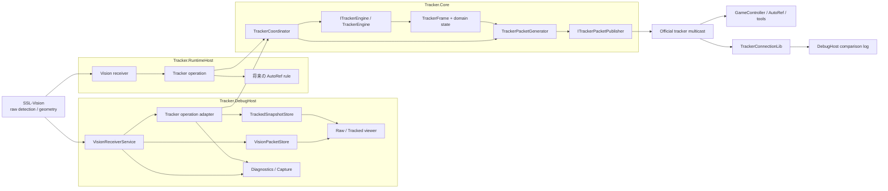
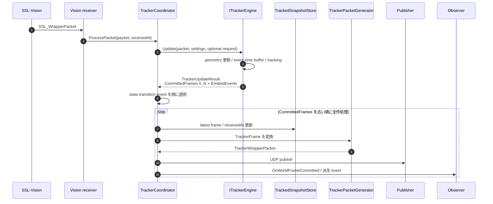
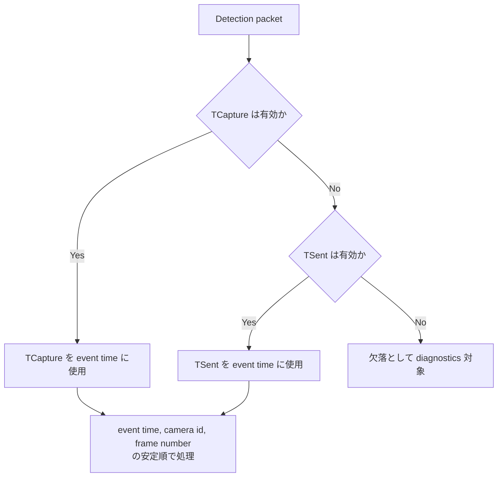
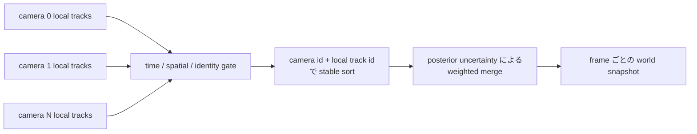
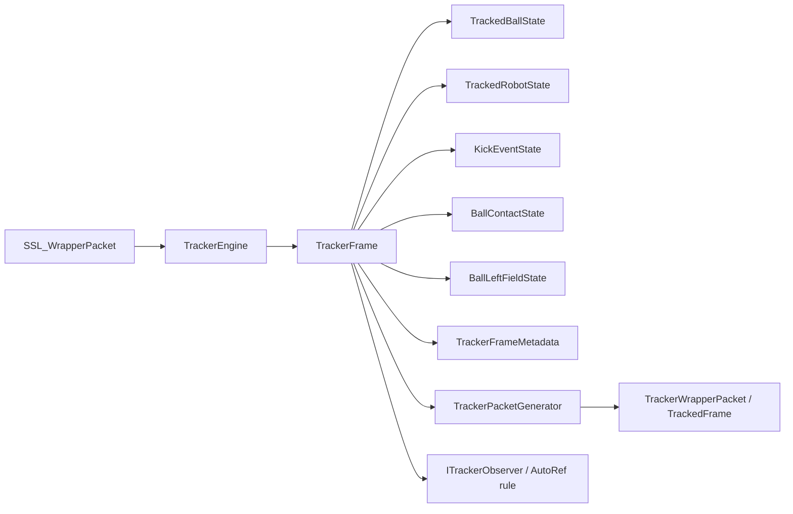
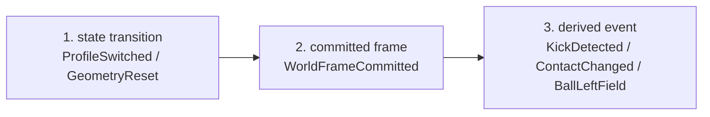
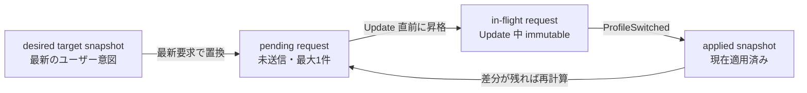
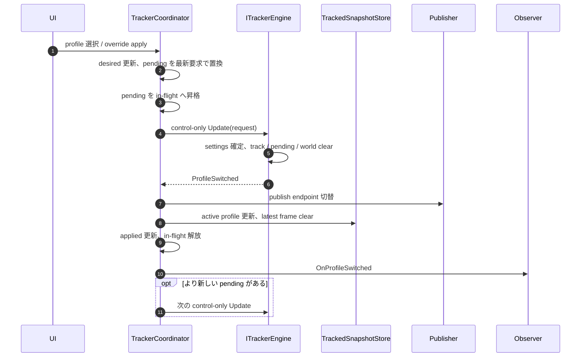
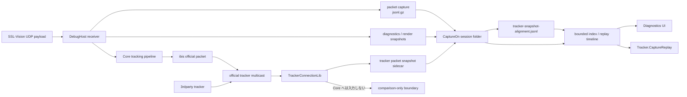

# Tracker アーキテクチャ概要

この文書は、[`tracker-architecture-plan.md`](tracker-architecture-plan.md) を読む前後に参照する**図解ガイド**である。

- 詳細な要件、例外、設定値、テスト方針、タスク分割は `tracker-architecture-plan.md` を正とする
- この文書は詳細設計を要約して置き換えるものではない
- 図は責務境界と主要フローを素早く把握するための補助資料とする

関連する詳細資料:

- [Tracker 詳細設計](tracker-architecture-plan.md)
- [DebugHost / CLI / UI CaptureOn 比較ログ詳細設計](../DebugHost/debug-host-cli-ui-detail-design.md)
- [DebugHost 保守性改善設計](../DebugHost/debug-host-maintainability-design.md)
- [TRACKER-000 から TRACKER-038 の履歴](tracker-history-000-038.md)

---

## 1. システム全体像

`Tracker.RuntimeHost` と `Tracker.DebugHost` は、それぞれ独立した Core pipeline instance を composeする。図中の `Tracker.Core` は共有プロセスを表すのではなく、両 host が同じ契約と実装を利用することを表す。

### 責務境界

| コンポーネント | 主責務 | 持ち込まない責務 |
| --- | --- | --- |
| `Tracker.Core` | tracking、内部 world、domain event、official packet 生成、UI 非依存の operation 契約 | Web UI、capture session、file logging、comparison UI |
| `Tracker.RuntimeHost` | 本番寄りの受信、tracking operation、UDP publish、将来の AutoRef 同居 | diagnostics viewer、replay UI |
| `Tracker.DebugHost` | raw / tracked viewer、diagnostics、capture / replay、comparison、debug config | tracking 数値ロジックの再実装 |
| `TrackerConnectionLib` | official tracker packet の受信と source 識別 | ibis tracker の内部 state 更新 |
| `Tracker.CaptureReplay` | 保存済み capture の再投入、metric、回帰確認、比較 | live Web UI |

最重要の依存規則は、`Tracker.Core` から `Tracker.DebugHost`、Blazor、diagnostics、capture session、sidecar path を参照しないことである。

---

## 2. Live tracking の処理フロー

### Coordinator が保証すること

- engine から返された `CommittedFrames` を古い順にすべて処理し、中間 frame を捨てない
- `CommittedFrames` が 0 件で、state transition event もない場合は publish や frame 更新を行わない
- profile switch や geometry reset の local state 遷移を完了してから observer へ通知する
- official packet は各 committed frame ごとに生成する
- UI rendering や diagnostics logging の周期で operation loop を駆動しない

---

## 3. Engine 内部パイプライン

```mermaid
flowchart LR
    Input["SSL_WrapperPacket<br/>または control-only Update"]
    Request["profile request を<br/>Update 先頭で適用"]
    Geometry["geometry snapshot 更新"]
    Buffer["detection を event time 順に buffer"]
    Flush["ReorderWindow を越えた group を flush"]
    Local["camera-local tracks<br/>Kalman predict / update"]
    Merge["camera 横断統合<br/>uncertainty-weighted"]
    Domain["kick / contact / field exit"]
    Result["TrackerUpdateResult<br/>0..N frames + ordered events"]

    Input --> Request --> Geometry --> Buffer --> Flush --> Local --> Merge --> Domain --> Result
```

### 時系列の基準

- UDP arrival order は world frame の確定順に使わない
- receive time / processing time は `TrackerFrame.data_timestamp_ns` に使わない
- geometry-only packet は geometry を更新するが `frame_number` を進めない
- flush 済み event time より古い late packet は状態更新へ使わない
- geometry の大変更時は、旧 geometry 世代の pending detection を破棄する

### Multi-camera 統合

v1 では camera-local Kalman state を統合し、merge 後の world に第2の永続 filter は置かない。

---

## 4. Core model と出力境界

### 単位変換境界

| 領域 | 位置 | 速度 | 角度 | 時刻 |
| --- | --- | --- | --- | --- |
| Core 内部 | `mm` | `mm/s` | `rad` | `ns` |
| official proto | `m` | `m/s` | proto 定義 | `s` |

単位変換は `TrackerPacketGenerator` の境界でのみ行う。

### Official packet の安定順

- `Balls[0]` は primary ball
- secondary ball は `visibility desc`、`last_visible_timestamp_ns desc`、`internal_track_id asc`
- robots は team と robot id で安定順を持つ
- capabilities は毎回同じ順で出す

---

## 5. Event publish 順

同一 phase 内は `TrackerUpdateResult.EmittedEvents` の格納順を正とする。rule や observer は raw packet を直接 subscribe せず、committed `TrackerFrame` と高レベル event を読む。

---

## 6. Profile 切替フロー

### 4種類の snapshot / request

### 切替 sequence

### 切替時の state

**clearする:** camera-local tracks、pending detection buffer、world snapshot、kick / contact / field metadata。

**維持する:** latest geometry、単調増加する `frame_number`、runtime identity (`Uuid`, `SourceName`)。

raw packet が届いていなくても pending request があれば control-only `Update` を実行し、最新の desired target へ収束する。

---

## 7. Capture / replay / comparison フロー

### Capture boundary の要点

- official packet の傍受、snapshot 保存、比較処理を `Tracker.Core` に入れない
- ibis自身のpacketもself除外せず保存対象にできる
- `uuid` / `sourceName` が空、重複、衝突しても raw payload とsource identityを落とさない
- packet capture、metadata、diagnostics、render snapshot、tracker snapshot、alignmentを同じsession folderで関連付ける
- snapshot sidecar と alignment sidecar の未作成、0件、破損を別々に表現する
- replay timeline の順序は capture-time `receivedAt` を基準にする
- sourceごとに時刻系が異なる可能性があるため、`TrackedFrame.timestamp` をsource横断のtimeline orderingへ使わない

---

## 8. 3つの時刻軸

| 値 | 用途 | tracking順序に使うか |
| --- | --- | --- |
| `TrackerFrame.data_timestamp_ns` | worldを構成した観測の基準時刻 | 使う |
| `TrackerFrame.processed_at_ns` | engineがframeを確定したローカル時刻 | 使わない |
| `receivedAt` | hostがpacket / sidecarを受信・保存した時刻 | live trackingには使わず、capture timelineに使う |

trackingのevent timeと、CaptureOn sessionのreplay timeを混同しない。

---

## 9. 変更時に確認する不変条件

### Core boundary

- CoreからDebugHost、Blazor、capture、diagnostics、session pathを参照していない
- host固有処理をCore operation loopへ持ち込んでいない
- tracking algorithmをhost側で重複実装していない

### Determinism

- arrival orderではなくevent timeで処理している
- buffer、merge、output、eventにstable orderがある
- tie-breakが明示されている
- 1 inputから複数frameが出ても中間frameを落とさない

### State transition

- desired / pending / in-flight / appliedを区別している
- `ProfileSwitched`前にactive profile表示やendpointを先行変更していない
- reset後も`frame_number`とruntime identityを維持している
- switch後のfirst frameが新settingsのstateだけを使う

### Capture / diagnostics

- CaptureOn sessionの成果物をfolderとmetadataで関連付けている
- snapshotとalignmentの状態を独立して診断できる
- raw payloadまたは復元可能な参照を保持している
- diagnostics / rendering cadenceがlive trackingを駆動していない

詳細な例外、設定値、データ形式、アルゴリズム要件は必ず [`tracker-architecture-plan.md`](tracker-architecture-plan.md) を参照する。