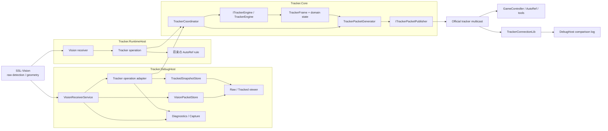
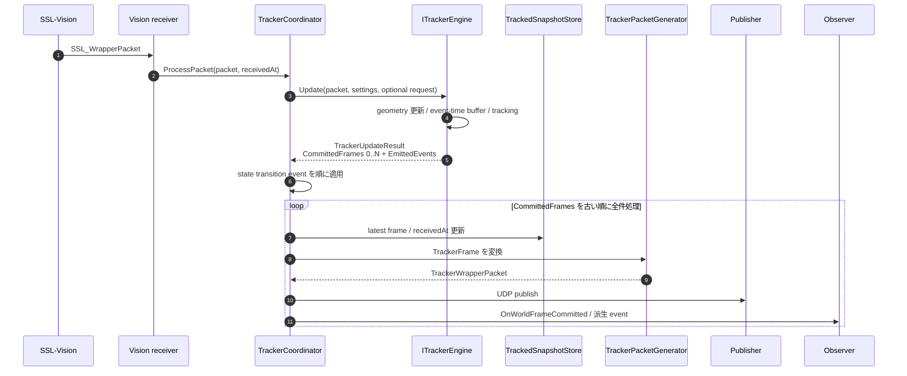
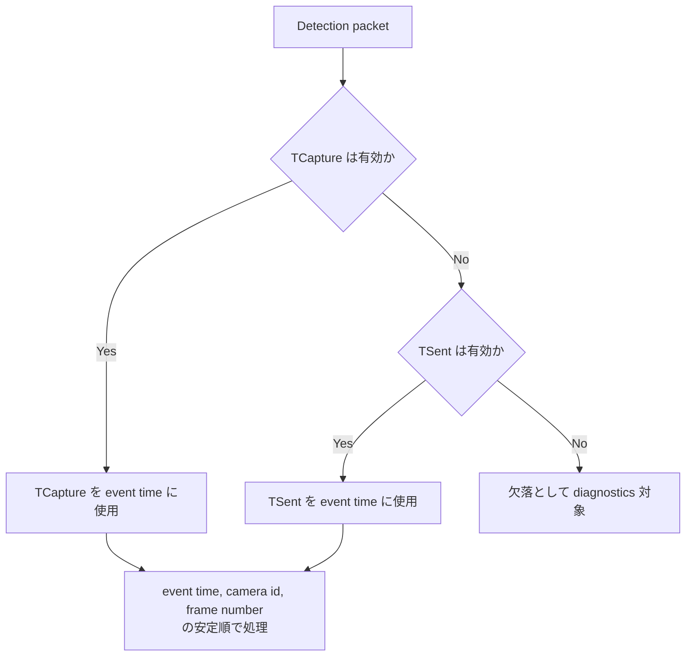
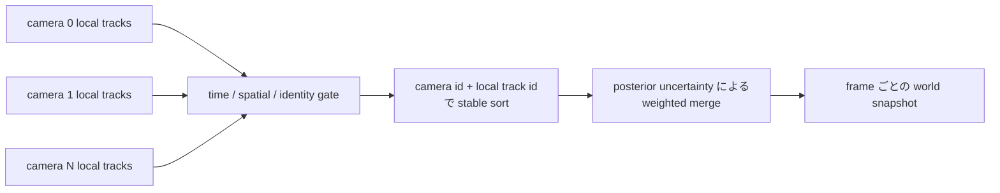
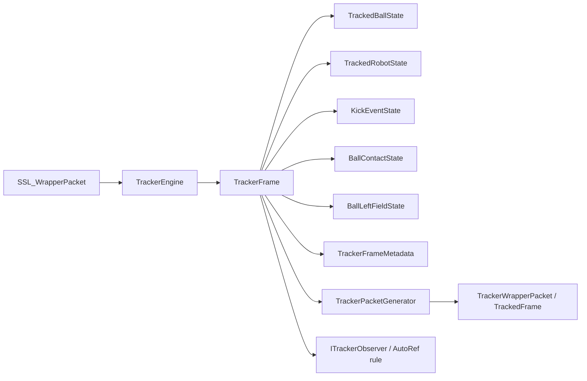
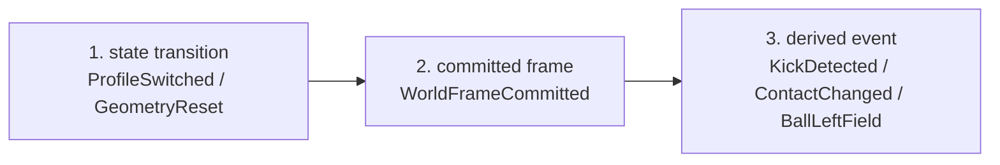
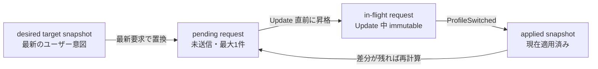
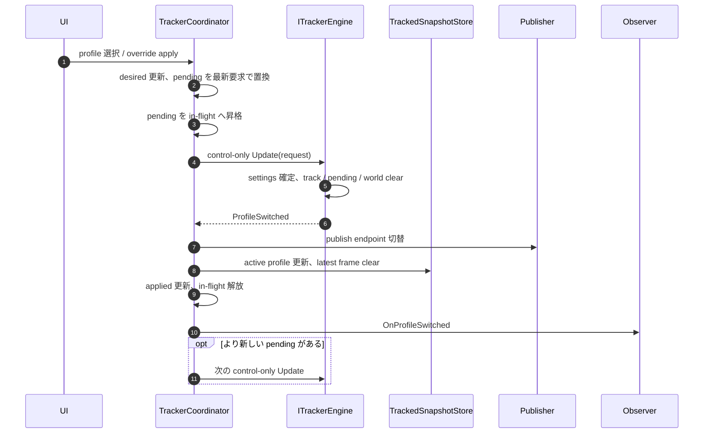
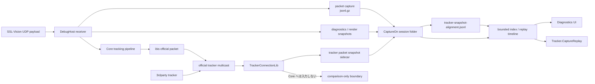

# AutoRef 向け Tracker アーキテクチャ計画

この文書は、Tracker v1 の**全体構成、責務境界、主要な処理フロー、設計上の不変条件**を図と表で把握するための正本である。

細かな入力型、保存形式、例外条件、設定値、アルゴリズム要件、TDD 方針、タスク分割は [Tracker アーキテクチャ詳細仕様](tracker-architecture-plan-details.md) を正とする。この文書と詳細仕様を合わせて、従来の設計情報をすべて構成する。

文字だけでは追いにくかった箇所のうち、図や表で同じ意味を表現できる部分は置き換えている。図だけでは条件や例外を表現しきれない箇所は、本文または詳細仕様に残す。

## 最初に読む場所

1. [システム全体像](#1-システム全体像)
2. [Live tracking の処理フロー](#2-live-tracking-の処理フロー)
3. [Profile 切替フロー](#6-profile-切替フロー)
4. [Capture / replay / comparison フロー](#7-capture--replay--comparison-フロー)
5. [詳細仕様との対応](#9-詳細仕様との対応)

## 関連文書

| 文書 | 役割 |
| --- | --- |
| この文書 | Tracker 全体のアーキテクチャ、主要フロー、責務境界、不変条件 |
| [Tracker アーキテクチャ詳細仕様](tracker-architecture-plan-details.md) | 入出力、例外、設定、追跡要件、TDD、タスク分割を含む詳細仕様 |
| [DebugHost / CLI / UI CaptureOn 比較ログ詳細設計](../DebugHost/debug-host-cli-ui-detail-design.md) | CaptureOn session、sidecar、alignment、UI / CLI 比較の詳細仕様 |
| [DebugHost 保守性改善設計](../DebugHost/debug-host-maintainability-design.md) | DebugHost / CLI / UI の分割・保守性方針 |
| [TRACKER-000 から TRACKER-038 の履歴](tracker-history-000-038.md) | 完了済みタスク、検証・レビュー履歴 |

---

## 1. システム全体像



`Tracker.RuntimeHost` と `Tracker.DebugHost` は、それぞれ独立した Core pipeline instance を compose する。図中の `Tracker.Core` は共有 process を表すのではなく、両 host が同じ契約と実装を利用することを表す。

### 1.1 責務境界

| コンポーネント | 主責務 | 持ち込まない責務 |
| --- | --- | --- |
| `Tracker.Core` | tracking、内部 world、domain event、official packet 生成、UI 非依存の operation 契約 | Web UI、capture session、file logging、comparison UI |
| `Tracker.RuntimeHost` | 本番寄りの受信、tracking operation、UDP publish、将来の AutoRef 同居 | diagnostics viewer、replay UI |
| `Tracker.DebugHost` | raw / tracked viewer、diagnostics、capture / replay、comparison、debug config | tracking 数値ロジックの再実装 |
| `TrackerConnectionLib` | official tracker packet の受信と source 識別 | ibis tracker の内部 state 更新 |
| `Tracker.CaptureReplay` | 保存済み capture の再投入、metric、回帰確認、比較 | live Web UI |
| `Tracker.Tests` | contract / regression / integration test | production orchestration |

最重要の依存規則は、`Tracker.Core` から `Tracker.DebugHost`、Blazor、diagnostics、capture session、sidecar path を参照しないことである。

### 1.2 対象範囲

- raw vision から決定的な tracked world を生成する
- official `TrackerWrapperPacket / TrackedFrame` を multicast 配信する
- official proto より豊富な内部 metadata を保持する
- primary ball を先頭にした複数 ball を出力する
- profile と runtime override を安全に切り替える
- kick / contact / ball-left-field metadata を AutoRef rule へ提供する
- raw / tracked viewer、diagnostics、capture / replay、comparison を提供する

対象外は、feedback packet / robot telemetry の tracking 入力利用、Tigers との完全一致、AutoRef rule 本体、v1 の永続 replay database、非決定的な learned model の標準採用である。

### 1.3 品質優先順位

1. 決定的であること
2. ルール上重要な情報を落とさないこと
3. official tracker proto と互換であること
4. raw / tracked の観察性が高いこと

---

## 2. Live tracking の処理フロー



### 2.1 Coordinator が保証すること

- engine から返された `CommittedFrames` を古い順にすべて処理し、中間 frame を捨てない
- `CommittedFrames` が 0 件で、state transition event もない場合は publish や frame 更新を行わない
- profile switch や geometry reset の local state 遷移を完了してから observer へ通知する
- official packet は各 committed frame ごとに生成する
- UI rendering や diagnostics logging の周期で operation loop を駆動しない
- profile request 受付、`Update`、result dispatch を同じ直列化区間で扱う

---

## 3. Engine 内部パイプライン

```mermaid
flowchart LR
    Input["SSL_WrapperPacket<br/>または control-only Update"]
    Request["profile request を<br/>Update 先頭で適用"]
    Geometry["geometry snapshot 更新"]
    Buffer["detection を event time 順に buffer"]
    Flush["ReorderWindow を越えた group を flush"]
    Local["camera-local tracks<br/>Kalman predict / update"]
    Merge["camera 横断統合<br/>uncertainty-weighted"]
    Domain["kick / contact / field exit"]
    Result["TrackerUpdateResult<br/>0..N frames + ordered events"]

    Input --> Request --> Geometry --> Buffer --> Flush --> Local --> Merge --> Domain --> Result
```



### 3.1 時系列の基準



- UDP arrival order は world frame の確定順に使わない
- receive time / processing time は `TrackerFrame.data_timestamp_ns` に使わない
- geometry-only packet は geometry を更新するが `frame_number` を進めない
- flush 済み event time より古い late packet は状態更新へ使わない
- geometry の大変更時は、旧 geometry 世代の pending detection を破棄する
- `ReorderWindow` と `MergeWindow` は設定から注入する

### 3.2 Multi-camera 統合



v1 では camera-local Kalman state を統合し、merge 後の world に第2の永続 filter は置かない。robot は `team + robot id`、ball は距離、速度上限、track 成長、直前 primary との整合を用いて対応付ける。詳細な gate、visibility、ghost 抑制、orientation unwrap は詳細仕様を参照する。

---

## 4. Core model と出力境界



### 4.1 時刻と単位

| 値 | 意味 |
| --- | --- |
| `TrackerFrame.data_timestamp_ns` | world を構成した観測の基準時刻。`TCapture`、欠落時は `TSent` |
| `TrackerFrame.processed_at_ns` | engine が frame を確定したローカル処理時刻。diagnostics 用 |
| `receivedAt` | packet / sidecar を host が受信・保存した時刻。capture timeline 用 |

| 領域 | 位置 | 速度 | 角度 | 時刻 |
| --- | --- | --- | --- | --- |
| Core 内部 | `mm` | `mm/s` | `rad` | `ns` |
| official proto | `m` | `m/s` | proto 定義 | `s` |

単位変換は `TrackerPacketGenerator` の境界でのみ行う。

### 4.2 Official packet の安定順

- `Balls[0]` は primary ball
- secondary ball は `visibility desc`、`last_visible_timestamp_ns desc`、`internal_track_id asc`
- robots は team と robot id で安定順を持つ
- capabilities は毎回同じ順で出す
- `kicked_ball` は kick 済みかつ still moving の間だけ出す

---

## 5. Event publish 順



同一 phase 内は `TrackerUpdateResult.EmittedEvents` の格納順を正とする。rule や observer は raw packet を直接 subscribe せず、committed `TrackerFrame` と高レベル event を読む。

`ITrackerObserver` の最小契約:

- `OnProfileSwitched`
- `OnGeometryReset`
- `OnWorldFrameCommitted`
- `OnKickDetected`
- `OnContactChanged`
- `OnBallLeftField`

---

## 6. Profile 切替フロー

### 6.1 4種類の snapshot / request



### 6.2 切替 sequence



### 6.3 切替規則

- coordinator は queue を積まず、最新のユーザー意図へ収束する
- in-flight request は result 処理完了まで書き換えない
- raw packet がなくても pending があれば control-only `Update` を実行する
- engine は `Update` の先頭で request を適用する
- `ProfileSwitched` 後に host 側 endpoint、active profile、store を原子的に切り替える
- receiver profile は `ProfileSwitched` 後の observer 側で切り替える
- first committed frame after switch は必ず新 profile の state から生成する

**clear する state:** camera-local tracks、pending detection buffer、world snapshot、kick / contact / field metadata。

**維持する state:** latest geometry、単調増加する `frame_number`、runtime identity (`Uuid`, `SourceName`)。

---

## 7. Capture / replay / comparison フロー



### 7.1 Capture boundary の要点

- official packet の傍受、snapshot 保存、比較処理を `Tracker.Core` に入れない
- ibis 自身の packet も self 除外せず保存対象にできる
- `uuid` / `sourceName` が空、重複、衝突しても raw payload と source identity を落とさない
- packet capture、metadata、diagnostics、render snapshot、tracker snapshot、alignment を同じ session folder で関連付ける
- snapshot sidecar と alignment sidecar の未作成、0件、破損を別々に表現する
- replay timeline の順序は capture-time `receivedAt` を基準にする
- source ごとに時刻系が異なる可能性があるため、`TrackedFrame.timestamp` を source 横断の timeline ordering へ使わない
- Capture Off / 再 On では新しい session folder へ切り替え、旧 session へ追記しない

保存 record、alignment v2、legacy fallback、Play / Fast Forward の挙動は DebugHost 詳細設計を正とする。

---

## 8. 設定と UI / rule 境界

### 8.1 設定の構成

```text
Tracker
├─ Enabled / PublishUdp / SourceName / Uuid
├─ ActiveProfileName
├─ Profiles
│  └─ <profile-name>
│     ├─ VisionReceiver
│     ├─ Publish
│     ├─ RobotTracker
│     ├─ BallTracker
│     └─ KickDetector
├─ RuntimeOverrides
└─ Diagnostics

VisionReceiver
└─ PacketCapture
   ├─ Enabled
   ├─ DirectoryPath
   ├─ FilePrefix
   └─ FlushEachPacket
```

外出しする主要値は receive / publish endpoint、`ReorderWindow`、`MergeWindow`、Kalman process / measurement noise、initial variance、association gate、outlier threshold、track lifetime、visibility、kick / chip / contact threshold、geometry reset threshold、diagnostics / capture path である。

### 8.2 UI

- raw viewer は `VisionPacketStore` を読む
- tracked viewer は `TrackedSnapshotStore` を読む
- `Raw / Tracked` を button で切り替える
- tracked view は primary / secondary ball、robots、profile、kick、contact、field state を表示する
- frame が clear された直後でも profile UI は操作可能にする
- UI rendering の周期は tracking operation loop を駆動しない

### 8.3 Rule

AutoRef rule は raw packet や camera-local track を直接読まず、committed `TrackerFrame` と高レベル event を読む。rule の追加が tracking core の数値処理へ影響しない境界を保つ。

---

## 9. 詳細仕様との対応

| この文書 | 詳細仕様で確認する章 | 詳細仕様に残る主な情報 |
| --- | --- | --- |
| 1. システム全体像 | 目的、対象範囲、対象外、基本方針、構成 | 参考実装の採否、proto 型一覧、構成要素の個別説明 |
| 2. Live tracking | 契約詳細、`TrackerCoordinator`、データフロー | 0-frame / multi-frame の細則、local state 更新順、receiver adapter 条件 |
| 3. Engine pipeline | 入出力詳細、multi-camera、アルゴリズム設計 | late packet、geometry generation、robot / ball filter の全要件 |
| 4. Core model | 内部出力、内部モデル方針、`TrackerPacketGenerator` | state 型の全 field、official proto field、capability、kick 寿命 |
| 5. Event publish | rule 連携 | observer interface、同一 phase 内の順序、同期 observer 方針 |
| 6. Profile switch | 設定、設定セット切替 | duplicate 判定、override snapshot、receiver 切替、identity 維持条件 |
| 7. Capture / replay | tracker packet snapshot 比較ログ、設定 | sidecar record、alignment v2、legacy fallback、timeline / playback 規則 |
| 8. 設定 / UI / rule | 設定、UI 方針、filter 設定 | 全設定項目、profile 例、UI 操作要件、既定 endpoint |
| TDD / 実装順 | テスト方針、タスク分割方針、承認ゲート | 最初の失敗テスト候補、TRACKER-000 以降の実装順、完了条件 |

図や表から実装判断が一意に決まらない場合は、詳細仕様の記述を優先する。

---

## 10. 変更時に確認する不変条件

### Core boundary

- [ ] Core から DebugHost / Blazor / capture / diagnostics を参照していない
- [ ] host 固有の file path や session lifecycle を Core に持ち込んでいない
- [ ] tracking algorithm を host 側で重複実装していない

### Determinism

- [ ] arrival order ではなく event time を使っている
- [ ] buffer / merge / output / event に stable order がある
- [ ] tie-break が明示されている
- [ ] 1 input から複数 frame が出ても欠落しない

### State transition

- [ ] profile request は desired / pending / in-flight / applied を区別している
- [ ] `ProfileSwitched` 前に active profile 表示や endpoint を先走って変えていない
- [ ] reset 後も `frame_number` と runtime identity を維持している
- [ ] first frame after switch が新 settings の state だけを使う

### Capture / diagnostics

- [ ] CaptureOn session の成果物を同じ folder と metadata で関連付けている
- [ ] snapshot と alignment の破損状態を別々に表現できる
- [ ] raw payload または復元可能な参照を保持している
- [ ] Core の live operation を diagnostics / rendering cadence に依存させていない

### Documentation

- [ ] 図で置き換えた条件が詳細仕様から失われていない
- [ ] Core の境界変更はこの文書へ反映した
- [ ] 例外・設定・保存形式の変更は詳細仕様へ反映した
- [ ] task / verification / review の履歴は tracking 文書へ同期した
