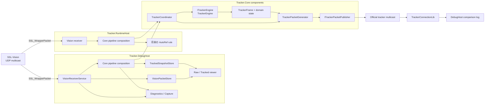
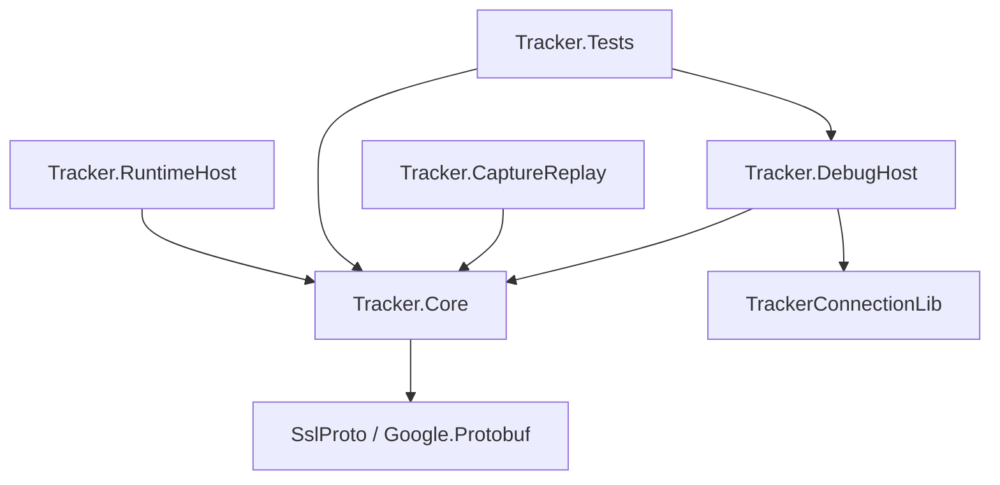
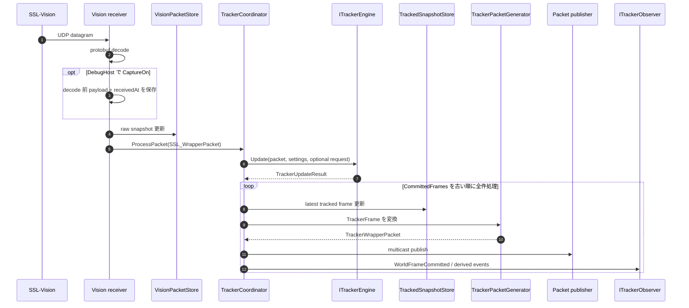
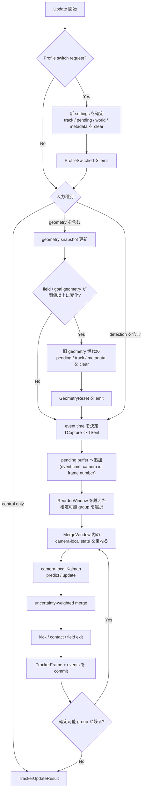
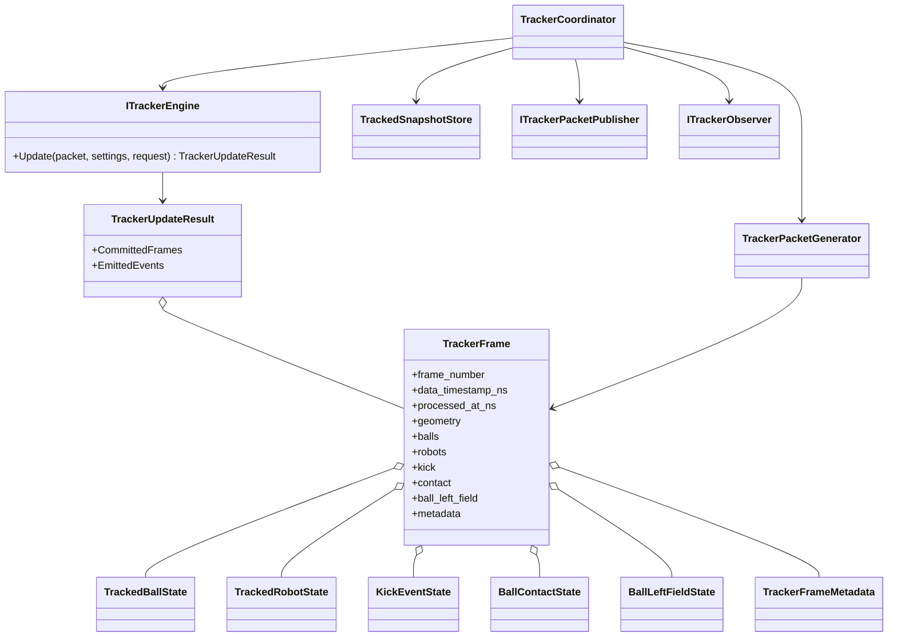
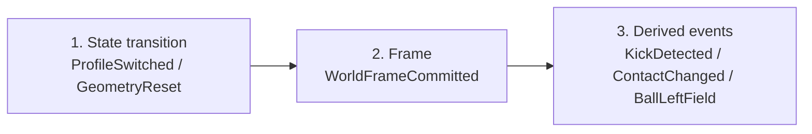
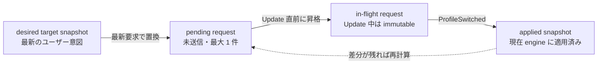
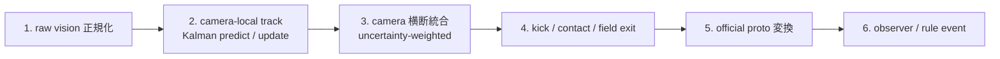
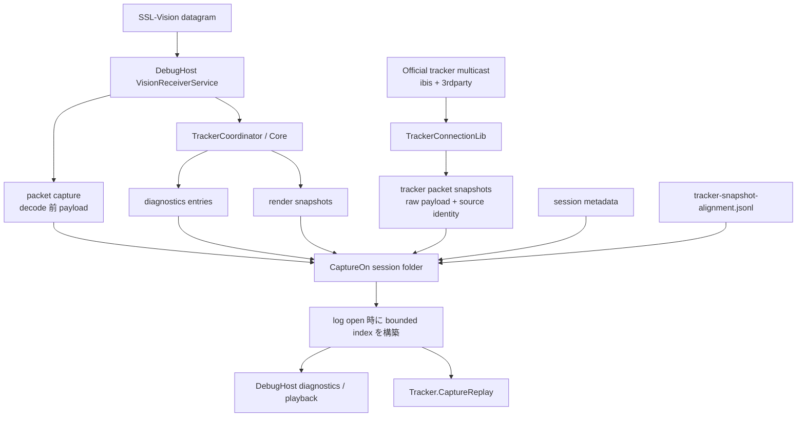
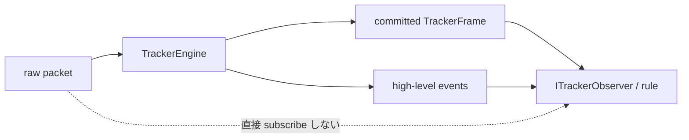

# AutoRef 向け Tracker アーキテクチャ

この文書は、Tracker v1 の**全体構成、責務境界、主要な処理フロー、Core 契約**を把握するための正本とする。
実装履歴や DebugHost 固有の詳細仕様は別文書へ分離し、この文書では「どのコンポーネントが、どの順序で、何を保証するか」を中心に示す。

> **最初に読む場所**
>
> 1. [30 秒でつかむ全体像](#1-30-秒でつかむ全体像)
> 2. [Live tracking の処理フロー](#3-live-tracking-の処理フロー)
> 3. [Profile 切替フロー](#5-profile-切替フロー)
> 4. [Capture / replay / comparison フロー](#7-capture--replay--comparison-フロー)

## 関連文書

| 文書 | 役割 |
| --- | --- |
| この文書 | Tracker 全体のアーキテクチャ、Core 契約、不変条件 |
| [DebugHost / CLI / UI CaptureOn 比較ログ詳細設計](../DebugHost/debug-host-cli-ui-detail-design.md) | CaptureOn session、sidecar、alignment、UI / CLI 比較の詳細仕様 |
| [DebugHost 保守性設計](../DebugHost/debug-host-maintainability-design.md) | DebugHost / CLI / UI の分割・保守性方針 |
| [TRACKER-000 から TRACKER-038 の履歴](tracker-history-000-038.md) | 完了済みタスク、検証・レビュー履歴 |
| `Ref/AutoReferee`（ローカル配置時） | Tigers AutoReferee の構成を確認するための参照実装 |

---

## 1. 30 秒でつかむ全体像

### 1.1 目的

Tracker は `SSL-Vision` の raw detection / geometry を受け取り、決定的な tracked world を生成する。
同じ tracked world から、official `TrackerWrapperPacket` と AutoRef 向けの高レベル event を作る。

初期目標は次の 4 点である。

1. raw vision から決定的な追跡結果を生成する
2. official `TrackerWrapperPacket / TrackedFrame` を multicast 配信する
3. official proto より豊富な内部メタ情報を保持する
4. AutoRef rule を world snapshot と高レベル event から記述できるようにする

### 1.2 システムコンテキスト



この図は component の責務と依存を示す。実行時には各 host が独立した Core pipeline instance を compose する。

### 1.3 依存方向



`Tracker.Core` はホストや UI の事情を知らない。依存方向を逆転させないことが最重要の境界である。

| コンポーネント | 主責務 | 持たない責務 |
| --- | --- | --- |
| `Tracker.Core` | tracking、内部 world、event、official packet 生成、UI 非依存 operation 契約 | Web UI、file logging、capture session、comparison |
| `Tracker.RuntimeHost` | 本番寄りの受信、operation、UDP publish、将来の AutoRef 同居 | diagnostics UI、比較表示 |
| `Tracker.DebugHost` | Web UI、raw/tracked 可視化、diagnostics、capture / replay 統合 | tracking 数値ロジックの再実装 |
| `TrackerConnectionLib` | official tracker packet の受信・source 識別 | ibis tracker 内部 state の更新 |
| `Tracker.CaptureReplay` | 保存済み capture の再生、metric、回帰確認、比較 | live host の UI |
| `Tracker.Tests` | contract / regression / integration test | production orchestration |

### 1.4 対象範囲と対象外

**対象範囲**

- `Tracker.Core` の内部モデル、engine 契約、tracking、proto 変換
- `Tracker.RuntimeHost` / `Tracker.DebugHost` から Core を利用する operation
- raw / tracked viewer、diagnostics、capture / replay、comparison
- primary ball を先頭にした複数 ball 出力
- profile と runtime override の安全な切替
- AutoRef 向け kick / contact / ball-left-field metadata

**対象外**

- feedback packet や robot telemetry を tracking 入力に使うこと
- Tigers と完全に同じ挙動を再現すること
- AutoRef rule 本体をこの scope で実装すること
- v1 で永続 replay database を持つこと
- learned model や非決定的な最適化を v1 の標準にすること

### 1.5 品質優先順位

1. 決定的であること
2. ルール上重要な情報を落とさないこと
3. official tracker proto と互換であること
4. raw / tracked の観察性が高いこと

---

## 2. アーキテクチャ上の決定事項

| 観点 | 決定 |
| --- | --- |
| 時系列 | UDP arrival order ではなく detection の event time で処理する |
| engine 出力 | 1 input あたり `0..N` 件の `CommittedFrames` を許可する |
| multi-camera | camera-local track を作り、同時刻近傍だけを uncertainty-weighted merge する |
| filter | v1 は線形 Kalman filter を標準とする |
| world state | v1 では merge 後の world に第 2 の永続 filter を置かない |
| 決定性 | buffer、merge、ball/robot 出力、event publish に stable order を持たせる |
| 単位 | Core は `mm`, `mm/s`, `rad`, `ns`。proto 境界でのみ official 単位へ変換する |
| host 分離 | RuntimeHost は operation、DebugHost は diagnostics / UI、Core は数値処理 |
| profile 切替 | request は engine が適用し、`ProfileSwitched` 後に host 側 state を原子的に切り替える |
| capture 比較 | Core から分離し、DebugHost + TrackerConnectionLib + sidecar で実現する |
| rule 連携 | rule は raw packet ではなく `TrackerFrame` と高レベル event を読む |

### 2.1 時刻と単位

| 値 | 意味 |
| --- | --- |
| `TrackerFrame.data_timestamp_ns` | world を構成した観測の基準時刻。`TCapture`、欠落時は `TSent` |
| `TrackerFrame.processed_at_ns` | engine が frame を確定したローカル処理時刻。diagnostics 用 |
| `receivedAt` | packet / sidecar を host が受信・保存した時刻。capture timeline 用 |

- receive time は tracking の統合順序に使わない
- `TrackerPacketGenerator` は `data_timestamp_ns` を `TrackedFrame.timestamp` へ変換する
- 内部位置は `mm`、速度は `mm/s`、角度は `rad`、時刻は `ns`
- official proto へ出すときだけ `m`, `m/s`, `s` へ変換する

---

## 3. Live tracking の処理フロー

### 3.1 受信から publish まで



**重要な規則**

- `CommittedFrames` が複数件なら、中間 frame を捨てず古い順にすべて処理する
- `TrackedSnapshotStore` には最後の committed frame を残す
- official packet は各 committed frame ごとに生成する
- frame が 0 件で state-change event もなければ、publish と viewer 更新を行わない
- profile / geometry reset event は frame より先に local state へ反映する

### 3.2 `ITrackerEngine.Update` の内部フロー



### 3.3 event-time 契約

- detection の event time は `TCapture`、欠落または 0 以下なら `TSent`
- pending buffer は `(event time, camera id, frame number)` の安定順
- `ReorderWindow` は arrival order の差を吸収する待ち窓
- `MergeWindow` は同一 world frame に統合できる camera 間時刻差
- world frame は anchor event time から `MergeWindow` 内の state だけで構成する
- flush 済み時刻より古い late packet は diagnostics に残し、state 更新には使わない
- geometry-only input は `frame_number` を進めない
- geometry 大変更時は旧世代の pending detection を破棄する
- `frame_number` は committed world frame ごとに単調増加する

---

## 4. Core の契約とデータモデル

### 4.1 関係図



### 4.2 `ITrackerEngine`

**入力**

- `SSL_WrapperPacket?`
  - detection / geometry input
  - control-only reconfigure では `null` を許可
- immutable な resolved settings
- optional `TrackerProfileSwitchRequest`
  - `RequestVersion`
  - profile 名
  - resolved base settings snapshot
  - `RuntimeOverrides` snapshot

**出力: `TrackerUpdateResult`**

- `CommittedFrames`
  - `0..N`
  - publish 順
- `EmittedEvents`
  - `ProfileSwitched`
  - `GeometryReset`
  - `WorldFrameCommitted`
  - `KickDetected`
  - `ContactChanged`
  - `BallLeftField`

**保持 state**

- event-time pending buffer
- camera ごとの packet timestamp
- camera-local robot / ball tracks
- latest world snapshot
- latest geometry
- monotonically increasing frame counter
- active settings
- kick / contact / field metadata

### 4.3 `TrackerCoordinator`

`TrackerCoordinator` は Core の runtime 境界であり、engine の数値処理と host の I/O を接続する。

**担当すること**

- raw packet と reconfigure request を engine へ渡す
- `TrackerUpdateResult` を順序どおり dispatch する
- latest snapshot を store へ反映する
- official packet を frame ごとに生成・publish する
- publisher endpoint、active profile 表示など engine 外 state を反映する
- observer を固定順で呼ぶ

**担当しないこと**

- engine state の直接 clear
- tracking algorithm の再実装
- diagnostics file の書き込み
- capture / replay / alignment の実装
- Blazor UI への依存

### 4.4 event publish 順



同一 phase 内の順序は `TrackerUpdateResult.EmittedEvents` を正とする。
observer は local state と store の更新が完了した後に呼ぶ。

### 4.5 `TrackerPacketGenerator`

`TrackerFrame` を official `TrackerWrapperPacket` へ変換する。

- `uuid` / `source_name`
- `mm -> m`, `mm/s -> m/s`, `ns -> s`
- primary / secondary ball
- robots
- `kicked_ball`
- capabilities

初期 capability:

- `CAPABILITY_DETECT_KICKED_BALLS`
- `CAPABILITY_DETECT_FLYING_BALLS`
- `CAPABILITY_DETECT_MULTIPLE_BALLS`

**stable output**

- `Balls[0]`: primary ball
- `Balls[1..]`: secondary ball
- secondary ball: `visibility desc`, `last_visible_timestamp_ns desc`, `internal_track_id asc`
- robots: team と robot id の安定順
- capabilities: 常に同じ順

### 4.6 `TrackedSnapshotStore`

UI と host が latest state を読むための Core 側 store。

- 最新 `TrackerFrame`
- 受信時刻
- active profile 名
- publish success / failure count
- profile switch / geometry reset 後の empty state

UI は frame の有無と profile 操作を分離し、frame が clear された直後でも profile UI を操作できるようにする。

---

## 5. Profile 切替フロー

### 5.1 4 つの snapshot



### 5.2 sequence


### 5.3 切替規則

- coordinator は queue を積まず、最新のユーザー意図へ収束する
- `desired target snapshot` と同値の操作だけを duplicate とする
- in-flight request は result 処理完了まで書き換えない
- raw packet がなくても pending があれば control-only `Update` を実行する
- engine は `Update` の先頭で request を適用する
- `ProfileSwitched` 後に host 側 endpoint、active profile、store を原子的に切り替える
- pending が残れば、その場で control-only `Update` を繰り返す
- first committed frame after switch は必ず新 profile の state から生成する

**clear する state**

- camera-local ball / robot tracks
- pending detection buffer
- world snapshot
- kick / contact / field metadata

**維持する state**

- latest geometry
- `frame_number`
- process runtime identity (`Uuid`, `SourceName`)

**profile で変更できるもの**

- raw vision receive endpoint
- official packet publish endpoint
- robot / ball / kick detector settings

---

## 6. Tracking algorithm のパイプライン

### 6.1 段階構成



v1 は決定的な古典的 tracking を採用し、particle filter や learned model を標準にはしない。

### 6.2 robot tracking

| 項目 | 契約 |
| --- | --- |
| identity | `team + robot id` |
| position state | `x, y, vx, vy` |
| orientation state | `theta, omega` |
| model | 位置は等速、向きは一定角速度 |
| filter | 位置系と向き系を別々の線形 Kalman filter で更新 |
| association | 同一 ID、予測位置、gate、近接重複抑制 |
| orientation | update 前に unwrap し、`-pi / pi` の跳びを吸収 |
| missing | predict のみ実行し、visibility を別責務で減衰 |
| output | stale track は内部に短時間残せるが、閾値未満なら外部へ出さない |
| merge | 同一 `team + robot id` の camera-local state を uncertainty で重み付け |

決定性のため、近接重複候補は confidence、robot id などの固定 tie-break で選ぶ。

### 6.3 ball tracking

| 項目 | 契約 |
| --- | --- |
| identity | raw id がないため内部 `track_id` を採番 |
| state | `x, y, z, vx, vy, vz` |
| model | 等速 |
| filter | track ごとの線形 Kalman filter |
| association | predicted state との gate。失敗時だけ新 track |
| growth | 生成直後は育成前。継続観測後に外部出力候補 |
| primary | previous primary、visibility、freshness、field importance、contact 整合で決定 |
| secondary | 成長済みだけを stable sort して出力 |
| missing | predict + visibility decay。stale は外部出力しない |
| merge | camera ごとに代表候補を選び、事後 uncertainty で統合 |

single-frame ghost を抑制しつつ、継続観測された genuine な複数 ball は保持する。

### 6.4 camera 横断統合

- 同一時刻近傍だけを対象にする
- ball は spatial gate と previous/chip projection 近傍で候補を絞る
- robot は同一 `team + robot id` だけを束ねる
- merge 前に `(camera id, local track id)` で安定整列する
- uncertainty が同じ場合は camera id と local track id で tie-break する
- merge 後の world に v1 では第 2 の永続 filter を置かない

### 6.5 kick / contact / ball-left-field

**kick**

- 短時間の速度増加
- 直前の robot 接触候補
- ball 進行方向と robot 前方の整合
- `z` / `vz` で flat / chip 候補を推定
- still moving の間だけ official `kicked_ball` を出力
- 停止、不可視 timeout、track 削除、新 kick で active kick を clear / replace

**contact**

- robot radius + ball radius + margin
- 距離、方向、相対速度で候補を順位付け
- current contact と last toucher を別 state で保持

**ball-left-field**

- geometry の field / line / goal を使う
- touch line、goal line、goal interior を区別する
- 複数 ball の各 track に対して判定する

---

## 7. Capture / replay / comparison フロー

この節は全体像だけを示す。保存 schema、alignment v2、UI / CLI の詳細は
[DebugHost / CLI / UI CaptureOn 比較ログ詳細設計](../DebugHost/debug-host-cli-ui-detail-design.md) を正とする。

### 7.1 責務とデータフロー



### 7.2 Core との境界

- Core は official packet の傍受、sidecar 保存、source comparison を行わない
- DebugHost が CaptureOn lifecycle と session folder を統合する
- `TrackerConnectionLib` が official packet の受信と source identity の入口になる
- ibis 自身の packet も保存対象から除外しない
- source 判別不能でも raw payload と identity 情報を落とさない

### 7.3 session folder

| 成果物 | 役割 |
| --- | --- |
| packet capture | decode 前の SSL-Vision payload と `receivedAt` |
| metadata | profile、resolved settings、各 sidecar の relative path、状態 |
| diagnostics sidecar | tracked operation の診断情報 |
| render snapshots | UI 再描画用 snapshot |
| tracker packet snapshots | ibis / 3rdparty official packet の主記録 |
| tracker snapshot alignment | replay timeline と各 source snapshot の対応 index |

### 7.4 timeline / playback の不変条件

- timeline ordering は session-relative `receivedAt`
- source 間で時刻系が違うため `TrackedFrame.timestamp` を全体 ordering に使わない
- snapshot sidecar と alignment sidecar は別 file
- 新規 capture は saved alignment を優先する
- legacy capture は明示的な degraded / best-effort 扱いにする
- Play は wall-clock に追従し、表示を約 30 fps に制限して latest tick を選ぶ
- scrub / Field source / comparison / CLI は任意 replay tick を選べる
- Capture Off 中は追記せず、再 On では新しい session folder を作る
- 表示用 summary だけでなく、raw payload または復元可能な参照を保存する

---

## 8. 設定モデル

### 8.1 解決規則

```text
resolved settings
  = Profiles[ActiveProfileName]
  + RuntimeOverrides
```

profile は環境ごとの基準値、runtime override は UI からの一時調整値である。
engine へ渡す時点で immutable snapshot に解決する。

### 8.2 構造

```text
Tracker
├─ Enabled
├─ Uuid
├─ SourceName
├─ ActiveProfileName
├─ Profiles
│  └─ <profile-name>
│     ├─ Receive
│     │  ├─ MulticastAddress
│     │  ├─ Port
│     │  └─ InterfaceAddress
│     ├─ Publish
│     │  ├─ MulticastAddress
│     │  └─ Port
│     ├─ RobotTracker
│     ├─ BallTracker
│     └─ KickDetector
├─ RuntimeOverrides
│  ├─ Publish
│  ├─ RobotTracker
│  ├─ BallTracker
│  └─ KickDetector
└─ Diagnostics
   └─ FilePath

VisionReceiver
└─ PacketCapture
   ├─ Enabled
   ├─ DirectoryPath
   ├─ FilePrefix
   └─ FlushEachPacket
```

既定 publish endpoint は official tracker の慣例値 `224.5.23.2:10010` を基準にできるが、code へ固定せず設定から注入する。

### 8.3 外出しする主要値

- multicast address / port / interface
- source name / uuid
- `ReorderWindow` / `MergeWindow`
- Kalman process / measurement noise
- initial velocity variance
- association gate
- speed / angular-speed outlier threshold
- track lifetime / visibility decay / output threshold
- kick / chip / contact threshold
- geometry reset threshold
- diagnostics / capture path

---

## 9. UI と rule 連携

### 9.1 UI

- raw viewer は `VisionPacketStore` を読む
- tracked viewer は `TrackedSnapshotStore` を読む
- `Raw / Tracked` を button で切り替える
- field geometry の見た目を揃えて比較しやすくする
- tracked view は primary / secondary ball、robots、profile、kick、contact、field state を表示する
- UI rendering の周期は tracking operation loop を駆動しない

### 9.2 rule

AutoRef rule は raw packet や camera-local track を直接読まない。



`ITrackerObserver` の最小契約:

- `OnProfileSwitched`
- `OnGeometryReset`
- `OnWorldFrameCommitted`
- `OnKickDetected`
- `OnContactChanged`
- `OnBallLeftField`

tracking core の数値処理と rule 実行を分離し、rule の追加が tracking 結果へ影響しないようにする。

---

## 10. Test / TDD 方針

契約を失敗テストで固定してから実装する。

### 10.1 最優先 contract

| 領域 | 最初に固定する契約 |
| --- | --- |
| packet generator | 単位変換、timestamp、primary/secondary order、capabilities、`kicked_ball` |
| event time | arrival order 非依存、`ReorderWindow`、`MergeWindow`、late packet |
| engine result | `0..N CommittedFrames`、中間 frame を落とさない |
| reset | profile switch、geometry reset、pending buffer clear、frame number 継続 |
| robot | velocity、orientation unwrap、stable association、stale suppression |
| ball | separate tracks、growth、primary selection、stable secondary order |
| events | state transition -> frame -> derived event の固定順 |
| boundary | observer は raw packet ではなく committed frame / event を受ける |
| capture | writer / reader round-trip、raw payload 復元、alignment status |
| UI | raw/tracked toggle、profile UI と empty frame の独立 |

### 10.2 検証コマンド

```bash
dotnet test Tracker/Tracker.Tests/Tracker.Tests.csproj
```

CI は test failure 時に、TRX、vstest diagnostics、binlog、stdout / stderr、環境情報、source archive を artifact として保存する。

---

## 11. 実装・変更時のチェックリスト

### Core boundary

- [ ] Core から DebugHost / Blazor / capture / diagnostics を参照していない
- [ ] host 固有の file path や session lifecycle を Core に持ち込んでいない
- [ ] tracking algorithm を host 側で重複実装していない

### Determinism

- [ ] arrival order ではなく event time を使っている
- [ ] buffer / merge / output / event に stable order がある
- [ ] tie-break が明示されている
- [ ] 1 input から複数 frame が出ても欠落しない

### State transition

- [ ] profile request は desired / pending / in-flight / applied を区別している
- [ ] `ProfileSwitched` 前に active profile 表示や endpoint を先走って変えていない
- [ ] reset 後も `frame_number` と runtime identity を維持している
- [ ] first frame after switch が新 settings の state だけを使う

### Capture / diagnostics

- [ ] CaptureOn session の成果物を同じ folder と metadata で関連付けている
- [ ] snapshot と alignment の破損状態を別々に表現できる
- [ ] raw payload または復元可能な参照を保持している
- [ ] Core の live operation を diagnostics / rendering cadence に依存させていない

### Documentation

- [ ] Core の境界変更はこの文書へ反映した
- [ ] DebugHost 固有仕様は詳細設計へ反映した
- [ ] task / verification / review の履歴は tracking 文書へ同期した
