# AutoRef 向け Tracker アーキテクチャ計画

この文書は、Tracker v1 の**全体構成、責務境界、主要な処理フロー、設計上の不変条件**を図と表で把握するための正本である。

細かな入力型、保存形式、例外条件、設定値、アルゴリズム要件、TDD 方針、タスク分割は [Tracker アーキテクチャ詳細仕様](tracker-architecture-plan-details.md) を正とする。この文書と詳細仕様を合わせて、従来の設計情報をすべて構成する。

文字だけでは追いにくかった箇所のうち、図や表で同じ意味を表現できる部分は置き換えている。図だけでは条件や例外を表現しきれない箇所は、本文または詳細仕様に残す。

## 最初に読む場所

1. [End-to-end 全体フロー](#12-end-to-end-全体フロー)
2. [全体フローと詳細図の対応](#13-全体フローと詳細図の対応)
3. [Live tracking の処理フロー](#2-live-tracking-の処理フロー)
4. [Engine 内部パイプライン](#3-engine-内部パイプライン)
5. [Profile 切替フロー](#6-profile-切替フロー)
6. [Capture / replay / comparison フロー](#7-capture--replay--comparison-フロー)
7. [詳細仕様との対応](#9-詳細仕様との対応)

## 関連文書

| 文書 | 役割 |
| --- | --- |
| この文書 | Tracker 全体のアーキテクチャ、主要フロー、責務境界、不変条件 |
| [Tracker アーキテクチャ詳細仕様](tracker-architecture-plan-details.md) | 入出力、例外、設定、追跡要件、TDD、タスク分割を含む詳細仕様 |
| [DebugHost / CLI / UI CaptureOn 比較ログ詳細設計](../DebugHost/debug-host-cli-ui-detail-design.md) | CaptureOn session、sidecar、alignment、UI / CLI 比較の詳細仕様 |
| [DebugHost 保守性改善設計](../DebugHost/debug-host-maintainability-design.md) | DebugHost / CLI / UI の分割・保守性方針 |
| [TRACKER-000 から TRACKER-038 の履歴](tracker-history-000-038.md) | 完了済みタスク、検証・レビュー履歴 |

---

## 1. システム全体像

### 1.1 システムコンテキスト

この図は**コンポーネントの配置と責務**を示す。処理順序を示す図ではない。処理順序は [1.2 End-to-end 全体フロー](#12-end-to-end-全体フロー) を起点に読む。

```mermaid
flowchart LR
    Vision["外部: SSL-Vision<br/>raw detection / geometry"]

    subgraph Runtime["Tracker.RuntimeHost"]
        RuntimeReceiver["RuntimeVisionReceiverService<br/>ExecuteAsync()"]
        RuntimeBuffer["RuntimeVisionPacketBuffer<br/>StorePacket() / TryTakeLatestBatch()"]
        RuntimeOperation["RuntimeHostOperationLoop<br/>ProcessLatestPacket()"]
        AutoRef["将来の AutoRef rule<br/>未実装"]
        RuntimeReceiver --> RuntimeBuffer --> RuntimeOperation --> AutoRef
    end

    subgraph Debug["Tracker.DebugHost"]
        DebugReceiver["VisionReceiverService<br/>ExecuteAsync()"]
        RawStore["VisionPacketStore<br/>StorePacket() / GetSnapshot()"]
        DebugOperation["VisionReceiverService.ExecuteAsync()<br/>TrackerCoordinator.ProcessPacket()"]
        TrackedStore["TrackedSnapshotStore<br/>UpdateLatestFrame() / GetSnapshot()"]
        Viewer["VisionLiveDisplaySnapshotProvider<br/>CaptureRenderTickSnapshot()"]
        Diagnostics["DiagnosticsSampleCaptureLoop.CaptureOnce()<br/>capture writer classes"]

        DebugReceiver --> RawStore --> Viewer
        DebugReceiver --> DebugOperation
        DebugOperation --> TrackedStore --> Viewer
        DebugReceiver --> Diagnostics
        DebugOperation --> Diagnostics
    end

    subgraph Core["Tracker.Core"]
        Coordinator["TrackerCoordinator<br/>ProcessPacket() / ExecuteUpdates() / DispatchResult()"]
        Engine["TrackerEngine<br/>Update()"]
        Frame["TrackerFrame<br/>(domain data type)"]
        Generator["TrackerPacketGenerator<br/>Generate()"]
        Publisher["UdpTrackerPacketPublisher<br/>Publish()"]

        Coordinator --> Engine
        Engine --> Frame
        Coordinator --> Generator
        Frame --> Generator
        Generator --> Publisher
    end

    Vision --> RuntimeReceiver
    Vision --> DebugReceiver
    RuntimeOperation --> Coordinator
    DebugOperation --> Coordinator

    Publisher --> Official["Official tracker multicast<br/>UdpTrackerPacketPublisher.Publish()"]
    Official --> Consumers["外部: GameController / AutoRef / tools"]
    Official --> ConnectionLib["UdpTrackerReceiver.ReceiveLoopAsync()<br/>MultiTrackerManager.ProcessPacket()"]
    ConnectionLib --> Comparison["ExternalTrackerSnapshotStore.GetSnapshot()<br/>TrackerPacketSnapshotLogWriter.Append()"]
```

`Tracker.RuntimeHost` と `Tracker.DebugHost` は、それぞれ独立した Core pipeline instance を compose する。図中の `Tracker.Core` は共有 process を表すのではなく、両 host が同じ契約と実装を利用することを表す。

### 1.2 End-to-end 全体フロー

以降の詳細図は、すべてこの `F1` から `F7` のどこを展開しているかを明記する。各ブロック内の `Class.Method()` は、その stage を開始または統括する主な実装 entry point である。

```mermaid
flowchart LR
    F1["F1. Vision packet 受信<br/>RuntimeVisionReceiverService.ExecuteAsync()<br/>VisionReceiverService.ExecuteAsync()"]
    F2["F2. Host adapter / Coordinator<br/>RuntimeHostOperationLoop.ProcessLatestPacket()<br/>VisionPacketStore.StorePacket()<br/>TrackerCoordinator.ProcessPacket()"]
    F3["F3. Engine update<br/>TrackerEngine.Update()"]
    F4["F4. Result dispatch<br/>TrackerCoordinator.DispatchResult()"]
    F5["F5. Core output<br/>TrackedSnapshotStore.UpdateLatestFrame()<br/>TrackerPacketGenerator.Generate()<br/>ITrackerPacketPublisher.Publish()<br/>TrackerCoordinator.NotifyObservers()"]
    F6["F6. Live consumer<br/>VisionLiveDisplaySnapshotProvider.CaptureRenderTickSnapshot()<br/>UdpTrackerPacketPublisher.Publish()<br/>ITrackerObserver.On...()"]
    F7["F7. Capture / comparison<br/>VisionPacketCaptureWriter.Capture()<br/>TrackerPacketSnapshotLogWriter.Append()<br/>TrackerSnapshotAlignmentLogWriter.WriteTimelineRecords()<br/>replay reader classes"]

    F1 --> F2 --> F3 --> F4 --> F5 --> F6
    F1 -.-> F7
    F6 -.-> F7
```

- 実線の `F1` から `F6` は live tracking の主経路である
- `F7` は `F1` の raw payload と `F6` で観測できる official packet から分岐する診断経路である
- `F7` のデータは `F3` の tracking state 更新へ戻さない
- profile 切替は `F1` から `F6` に並ぶ追加 stage ではなく、`F2`、`F3`、`F4`、`F5` を横断する control flow `C1` として扱う

### 1.3 全体フローと詳細図の対応

| 全体 stage | 主な実装 entry point | 役割 | 展開する章 |
| --- | --- | --- | --- |
| `F1` | `RuntimeVisionReceiverService.ExecuteAsync()` / `VisionReceiverService.ExecuteAsync()` | SSL-Vision packet / UDP payload の受信 | 2. Live tracking、7. Capture / replay |
| `F2` | `RuntimeHostOperationLoop.ProcessLatestPacket()` / `VisionPacketStore.StorePacket()` / `TrackerCoordinator.ProcessPacket()` | host adapter、raw store / capture、coordinator の直列化 | 2. Live tracking、6. Profile switch |
| `F3` | `TrackerEngine.Update()` と `TrackerEngine` partial methods | request 適用、event-time buffer、camera-local tracking、merge、domain metadata | 3. Engine 内部パイプライン |
| `F4` | `TrackerCoordinator.DispatchResult()` | `TrackerUpdateResult` の state transition / frame / derived event dispatch | 2. Live tracking、5. Result dispatch |
| `F5` | `TrackedSnapshotStore.UpdateLatestFrame()` / `TrackerPacketGenerator.Generate()` / `PublishFrame()` / `NotifyObservers()` | snapshot store、official packet、publisher、observer の境界 | 4. Core data model、5. Result dispatch |
| `F6` | `VisionLiveDisplaySnapshotProvider.CaptureRenderTickSnapshot()` / `UdpTrackerPacketPublisher.Publish()` / `ITrackerObserver` callbacks | viewer、official multicast consumer、AutoRef rule | 2. Live tracking、8. UI / rule |
| `F7` | capture writer classes / `TrackerSnapshotReplayReader.ReadSession()` / `TrackerDiagnosticsComparisonViewStateReader.Load()` | CaptureOn session、snapshot / alignment sidecar、replay / comparison | 7. Capture / replay |
| `C1` | `TrackerProfileRequestService.RequestProfileSwitch()` / `TrackerCoordinator.RequestProfileSwitch()` / `ApplyProfileSwitch()` | profile / override の切替 control flow | 6. Profile switch |

### 1.4 図の読み方

- `F#` は End-to-end 全体フローの stage を表す
- `F3.1` のような番号は、stage `F3` の内部処理を表す
- `C1` は live data flow と別系統の profile 切替 control flow を表す
- `Class.Method()` はそのブロックを統括する実装 entry point を表す
- `Class.field` は独立した関数ではなく保持状態を表す
- `(data type)` は処理ではなく、stage 間を流れる契約型を表す
- `外部` と `未実装` はリポジトリ内に対応関数がないことを表す
- 複数の private helper が関与するブロックでは、代表的な method を図中に記載し、詳細は本文と詳細仕様を参照する
- `sequenceDiagram` は実行順、`flowchart` は処理の分解またはデータ境界を表す
- 4章の図は時系列フローではなく、`F3` から `F5` に渡るデータモデルと依存境界を表す
- 詳細図から全体へ戻るときは、図中の `F#` を 1.2 の同じ stage に対応付ける

### 1.5 責務境界

| コンポーネント | 主責務 | 持ち込まない責務 |
| --- | --- | --- |
| `Tracker.Core` | tracking、内部 world、domain event、official packet 生成、UI 非依存の operation 契約 | Web UI、capture session、file logging、comparison UI |
| `Tracker.RuntimeHost` | 本番寄りの受信、tracking operation、UDP publish、将来の AutoRef 同居 | diagnostics viewer、replay UI |
| `Tracker.DebugHost` | raw / tracked viewer、diagnostics、capture / replay、comparison、debug config | tracking 数値ロジックの再実装 |
| `TrackerConnectionLib` | official tracker packet の受信と source 識別 | ibis tracker の内部 state 更新 |
| `Tracker.CaptureReplay` | 保存済み capture の再投入、metric、回帰確認、比較 | live Web UI |
| `Tracker.Tests` | contract / regression / integration test | production orchestration |

最重要の依存規則は、`Tracker.Core` から `Tracker.DebugHost`、Blazor、diagnostics、capture session、sidecar path を参照しないことである。

### 1.6 対象範囲

- raw vision から決定的な tracked world を生成する
- official `TrackerWrapperPacket / TrackedFrame` を multicast 配信する
- official proto より豊富な内部 metadata を保持する
- primary ball を先頭にした複数 ball を出力する
- profile と runtime override を安全に切り替える
- kick / contact / ball-left-field metadata を AutoRef rule へ提供する
- raw / tracked viewer、diagnostics、capture / replay、comparison を提供する

対象外は、feedback packet / robot telemetry の tracking 入力利用、Tigers との完全一致、AutoRef rule 本体、v1 の永続 replay database、非決定的な learned model の標準採用である。

### 1.7 品質優先順位

1. 決定的であること
2. ルール上重要な情報を落とさないこと
3. official tracker proto と互換であること
4. raw / tracked の観察性が高いこと

---

## 2. Live tracking の処理フロー

この sequence は、全体フローの `F1` から `F6` を実行順に展開する。`F3` の内部は3章、`F4` の dispatch 順は5章、`F5` のデータ境界は4章でさらに展開する。

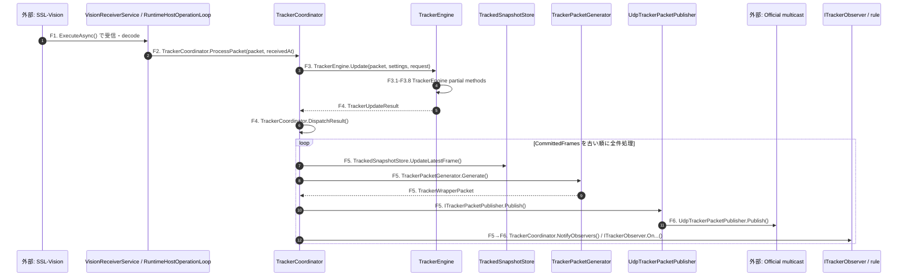

DebugHost viewer は `VisionLiveDisplaySnapshotProvider.CaptureRenderTickSnapshot()` を通じて `VisionPacketStore.GetSnapshot()`、`TrackedSnapshotStore.GetSnapshot()`、`ExternalTrackerSnapshotStore.GetSnapshot()` を読み取る。official tracker consumer は `F6` の multicast を読む。どちらも tracking operation loop を駆動しない。

RuntimeHost では `RuntimeVisionReceiverService.ExecuteAsync()` が `RuntimeVisionPacketBuffer.StorePacket()` へ保存し、`RuntimeHostLifecycleService.ExecuteAsync()` が周期的に `RuntimeHostOperationLoop.ProcessLatestPacket()` を呼ぶ。DebugHost では `VisionReceiverService.ExecuteAsync()` が decode、raw store、capture の後に `TrackerCoordinator.ProcessPacket()` を直接呼ぶ。

### 2.1 Coordinator が保証すること

- engine から返された `CommittedFrames` を古い順にすべて処理し、中間 frame を捨てない
- `CommittedFrames` が 0 件で、state transition event もない場合は publish や frame 更新を行わない
- profile switch や geometry reset の local state 遷移を完了してから observer へ通知する
- official packet は各 committed frame ごとに生成する
- UI rendering や diagnostics logging の周期で operation loop を駆動しない
- profile request 受付、`Update`、result dispatch を同じ直列化区間で扱う

---

## 3. Engine 内部パイプライン

この章は、全体フローの **`F3. Engine update` だけを展開する**。入力は `F2` から受け取り、結果を `F4` へ返す。3.1 は `F3.3` から `F3.4`、3.2 は `F3.5` から `F3.6` に対応する。

```mermaid
flowchart LR
    Input["F2→F3<br/>TrackerCoordinator.ExecuteUpdates()<br/>TrackerEngine.Update(...)"]
    Request["F3.1 profile request 適用<br/>TrackerEngine.Update()<br/>ClearPendingStateAndAdvanceLateCutoff()"]
    Geometry["F3.2 geometry snapshot 更新<br/>CreateGeometrySnapshot()<br/>ShouldResetForGeometryChange()"]
    Buffer["F3.3 event time 決定・buffer<br/>CreateBufferedDetection()<br/>pendingDetections.Add()"]
    Flush["F3.4 ReorderWindow 判定・flush<br/>FlushCommittedFrames()<br/>BuildDetectionGroups()"]
    Local["F3.5 camera-local Kalman update<br/>UpdateCameraBallTrackStates()<br/>UpdateCameraRobotTrackStates()"]
    Merge["F3.6 camera 横断 merge<br/>CollectMergedBallStates()<br/>CollectMergedRobotStates()"]
    Domain["F3.7 domain metadata<br/>UpdateKickState()<br/>CreateBallContactState()<br/>CreateBallLeftFieldState()"]
    Result["F3.8→F4 frame / event 構築<br/>CommitGroup()<br/>TrackerUpdateResult (data type)"]

    Input --> Request --> Geometry --> Buffer --> Flush --> Local --> Merge --> Domain --> Result
```

### 3.1 F3.3-F3.4: event time、buffer、flush

この図は、上の Engine pipeline の `F3.3` と `F3.4` を展開する。

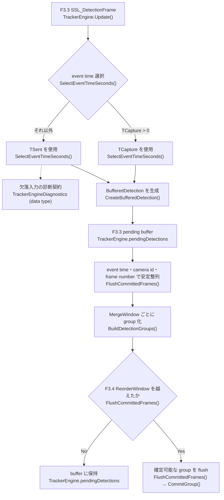

- UDP arrival order は world frame の確定順に使わない
- receive time / processing time は `TrackerFrame.data_timestamp_ns` に使わない
- geometry-only packet は geometry を更新するが `frame_number` を進めない
- flush 済み event time より古い late packet は状態更新へ使わない
- geometry の大変更時は、旧 geometry 世代の pending detection を破棄する
- `ReorderWindow` と `MergeWindow` は設定から注入する

### 3.2 F3.5-F3.6: camera-local tracking と multi-camera 統合

この図は、Engine pipeline の `F3.5` と `F3.6` を展開し、結果が `F3.7` と `F3.8` へ渡る位置までを示す。

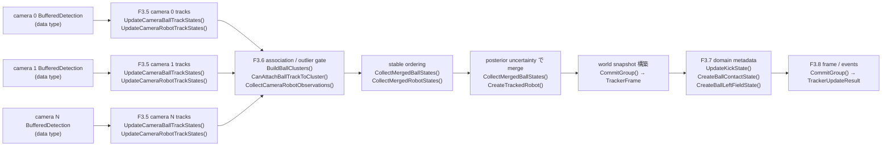

ball の camera-local predict / update は `PredictBallTrackState()`、`CreateObservedBallTrackState()`、`CreatePredictedBallTrackState()` が担う。robot は `PredictRobotTrackState()`、`CreateObservedRobotTrackState()`、`CreatePredictedRobotTrackState()` が担う。

v1 では camera-local Kalman state を統合し、merge 後の world に第2の永続 filter は置かない。robot は `team + robot id`、ball は距離、速度上限、track 成長、直前 primary との整合を用いて対応付ける。詳細な gate、visibility、ghost 抑制、orientation unwrap は詳細仕様を参照する。

---

## 4. F3.8-F5: Core data model と出力境界

この図は**時系列の処理フローではない**。`F3.8` が生成した `TrackerUpdateResult` を `F4` が dispatch し、`F5` の store、packet、observer へ渡すときのデータモデルと依存境界を示す。

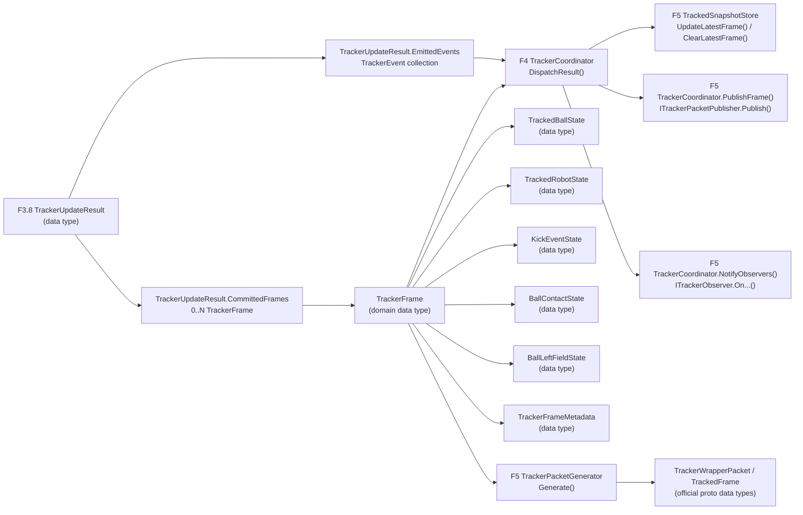

### 4.1 時刻と単位

| 値 | 意味 |
| --- | --- |
| `TrackerFrame.data_timestamp_ns` | world を構成した観測の基準時刻。`TCapture`、欠落時は `TSent` |
| `TrackerFrame.processed_at_ns` | engine が frame を確定したローカル処理時刻。diagnostics 用 |
| `receivedAt` | packet / sidecar を host が受信・保存した時刻。capture timeline 用 |

| 領域 | 位置 | 速度 | 角度 | 時刻 |
| --- | --- | --- | --- | --- |
| Core 内部 | `mm` | `mm/s` | `rad` | `ns` |
| official proto | `m` | `m/s` | proto 定義 | `s` |

単位変換は `TrackerPacketGenerator.Generate()` が呼ぶ `CreateTrackedBall()`、`CreateTrackedRobot()`、`CreateKickedBall()` の境界で行う。

### 4.2 Official packet の安定順

- `TrackerPacketGenerator.OrderBalls()` が `Balls[0]` を primary ball に固定する
- secondary ball は `visibility desc`、`last_visible_timestamp_ns desc`、`internal_track_id asc`
- `TrackerPacketGenerator.Generate()` が robots を team と robot id の安定順に並べる
- capabilities は毎回同じ順で出す
- `kicked_ball` は kick 済みかつ still moving の間だけ出す

---

## 5. F4: Result dispatch と event publish 順

この章は、全体フローの **`F4. Result dispatch`** を展開する。`F3.8` の結果を受け取り、state transition、committed frame、derived event の順で処理した後、`F5` の出力へ渡す。

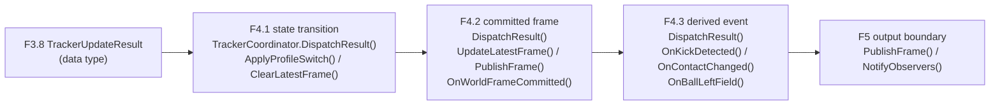

`TrackerCoordinator.DispatchResult()` は `TrackerUpdateResult.EmittedEvents` を順に走査し、`TrackerEventKind` ごとに store、publish、observer callback を呼び分ける。同一 phase 内は `EmittedEvents` の格納順を正とする。

`ITrackerObserver` の最小契約:

- `OnProfileSwitched`
- `OnGeometryReset`
- `OnWorldFrameCommitted`
- `OnKickDetected`
- `OnContactChanged`
- `OnBallLeftField`

---

## 6. Profile 切替フロー

profile 切替は End-to-end 全体フローに直列追加される stage ではない。control flow `C1` として、`F2` の coordinator request 管理、`F3.1` の engine 適用、`F4` の `ProfileSwitched` dispatch、`F5` の host state 更新を横断する。

| control step | 全体フロー上の位置 | 主な実装 |
| --- | --- | --- |
| `C1.1` desired / pending / in-flight 管理 | `F2` TrackerCoordinator | `TrackerProfileRequestService.RequestProfileSwitch()` / `TrackerCoordinator.RequestProfileSwitch()` / `PromotePendingRequest()` |
| `C1.2` request を `Update` 先頭で適用 | `F3.1` | `TrackerEngine.Update()` / `ClearPendingStateAndAdvanceLateCutoff()` |
| `C1.3` `ProfileSwitched` を返して dispatch | `F4` | `TrackerEngine.Update()` / `TrackerCoordinator.DispatchResult()` |
| `C1.4` endpoint / active profile / store を更新 | `F5` | `TrackerCoordinator.ApplyProfileSwitch()` / `UdpTrackerPacketPublisher.ApplyConfiguration()` / `TrackedSnapshotStore.SwitchActiveProfile()` |

### 6.1 C1.1: 4種類の snapshot / request

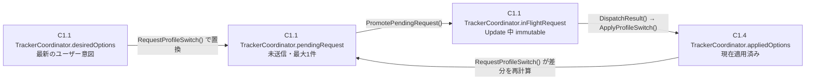

### 6.2 C1.1-C1.4: 切替 sequence

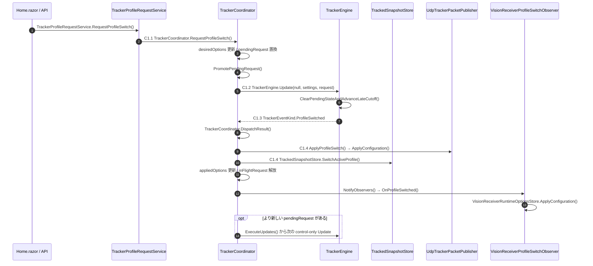

### 6.3 切替規則

- coordinator は queue を積まず、最新のユーザー意図へ収束する
- in-flight request は result 処理完了まで書き換えない
- raw packet がなくても pending があれば `TrackerCoordinator.ExecuteUpdates()` が control-only `Update` を実行する
- engine は `TrackerEngine.Update()` の先頭で request を適用する
- `ProfileSwitched` 後に `TrackerCoordinator.ApplyProfileSwitch()` が host 側 endpoint、active profile、store を原子的に切り替える
- receiver profile は `VisionReceiverProfileSwitchObserver.OnProfileSwitched()` で切り替える
- first committed frame after switch は必ず新 profile の state から生成する

**clear する state:** camera-local tracks、pending detection buffer、world snapshot、kick / contact / field metadata。

**維持する state:** latest geometry、単調増加する `frame_number`、runtime identity (`Uuid`, `SourceName`)。

---

## 7. Capture / replay / comparison フロー

この章は End-to-end 全体フローの **`F7`** を展開する。`F7` は `F1` の raw payload と `F6` の official multicast から分岐する。`F7` で保存・比較したデータは `F3` の live tracking state へ入力しない。

```mermaid
flowchart LR
    Vision["F1 外部: SSL-Vision UDP payload"] --> Receiver["F2 VisionReceiverService<br/>ExecuteAsync()"]
    Receiver --> Core["F3-F5<br/>TrackerCoordinator.ProcessPacket()<br/>TrackerEngine.Update()<br/>DispatchResult()"]
    Core --> OwnPacket["F5 ibis official packet<br/>TrackerPacketGenerator.Generate()"]
    OwnPacket --> Multicast["F6 official multicast<br/>UdpTrackerPacketPublisher.Publish()"]

    Receiver --> RawCapture["F7.1 raw packet capture<br/>VisionPacketCaptureWriter.Capture()"]
    Receiver --> Diagnostics["F7.1 diagnostics sample<br/>DiagnosticsSampleCaptureLoop.CaptureOnce()<br/>TrackerRenderSnapshotCaptureWriter.CaptureFrame()"]

    ThirdParty["外部: 3rdparty tracker"] --> Multicast
    Multicast --> Connection["F7.2 official packet 受信<br/>UdpTrackerReceiver.ReceiveLoopAsync()<br/>TrackerConnectionLibReceiverHostedService.ProcessPacket()<br/>MultiTrackerManager.ProcessPacket()"]
    Connection --> Snapshot["F7.2 snapshot sidecar<br/>TrackerConnectionLibSnapshotRecorder.CaptureTrackerUpdate()<br/>TrackerPacketSnapshotLogWriter.CapturePacket() / Append()"]

    RawCapture --> Session["F7.3 CaptureOn session<br/>VisionPacketCaptureSession.EnsureStarted()<br/>WriteMetadata()"]
    Diagnostics --> Session
    Snapshot --> Session
    Session --> Alignment["F7.3 alignment sidecar<br/>TrackerSnapshotAlignmentLogWriter.WriteTimelineRecords()"]
    Alignment --> Reader["F7.4 replay index / view-state<br/>TrackerSnapshotReplayReader.ReadSession()<br/>TrackerDiagnosticsComparisonViewStateReader.Load()"]
    Session --> Reader
    Reader --> UI["F7.4 Diagnostics UI<br/>Diagnostics.razor<br/>TrackerDiagnosticsComparisonViewStateReader.Load()"]
    Reader --> CLI["F7.4 Tracker.CaptureReplay<br/>CaptureReplayRunner.Run()"]

    Connection -.-> Isolation["comparison-only boundary<br/>TrackerEngine.Update() を呼ばない"]
```

### 7.1 Capture boundary の要点

- `VisionReceiverService.ExecuteAsync()` は protobuf decode 前の payload を `VisionPacketCaptureWriter.Capture()` へ渡す
- `UdpTrackerReceiver.ReceiveLoopAsync()` は official packet を受信し、`TrackerConnectionLibReceiverHostedService.ProcessPacket()` が `MultiTrackerManager.ProcessPacket()` へ渡す
- `TrackerConnectionLibSnapshotRecorder.CaptureTrackerUpdate()` は `TrackerUpdated` event を受け、`TrackerPacketSnapshotLogWriter.CapturePacket()` へ保存する
- official packet の傍受、snapshot 保存、比較処理を `Tracker.Core` に入れない
- ibis 自身の packet も self 除外せず保存対象にできる
- `uuid` / `sourceName` が空、重複、衝突しても raw payload と source identity を落とさない
- packet capture、metadata、diagnostics、render snapshot、tracker snapshot、alignment を同じ session folder で関連付ける
- snapshot sidecar と alignment sidecar の未作成、0件、破損を別々に表現する
- replay timeline の順序は capture-time `receivedAt` を基準にする
- source ごとに時刻系が異なる可能性があるため、`TrackedFrame.timestamp` を source 横断の timeline ordering へ使わない
- Capture Off / 再 On では新しい session folder へ切り替え、旧 session へ追記しない

保存 record、alignment v2、legacy fallback、Play / Fast Forward の挙動は DebugHost 詳細設計を正とする。

---

## 8. 設定と UI / rule 境界

### 8.1 設定の構成

```text
Tracker
├─ Enabled / PublishUdp / SourceName / Uuid
├─ ActiveProfileName
├─ Profiles
│  └─ <profile-name>
│     ├─ VisionReceiver
│     ├─ Publish
│     ├─ RobotTracker
│     ├─ BallTracker
│     └─ KickDetector
├─ RuntimeOverrides
└─ Diagnostics

VisionReceiver
└─ PacketCapture
   ├─ Enabled
   ├─ DirectoryPath
   ├─ FilePrefix
   └─ FlushEachPacket
```

`TrackerConfigurationResolver.Resolve()` が tracker profile と runtime override を解決する。`VisionReceiverConfigurationResolver.Resolve()` が receiver profile を解決し、`VisionReceiverRuntimeOptionsStore.ApplyConfiguration()` が runtime receiver 設定へ反映する。

外出しする主要値は receive / publish endpoint、`ReorderWindow`、`MergeWindow`、Kalman process / measurement noise、initial variance、association gate、outlier threshold、track lifetime、visibility、kick / chip / contact threshold、geometry reset threshold、diagnostics / capture path である。

### 8.2 F5-F6: UI

- `VisionLiveDisplaySnapshotProvider.CaptureRenderTickSnapshot()` が 1 render tick の raw / tracked / external tracker snapshot を固定する
- raw viewer は `VisionPacketStore.GetSnapshot()` を読む
- tracked viewer は `TrackedSnapshotStore.GetSnapshot()` を読む
- external comparison は `ExternalTrackerSnapshotStore.GetSnapshot()` を読む
- `Home.razor` の `CaptureLiveDisplaySnapshot()` と `RefreshAsync()` が read-side snapshot を UI state へ反映する
- `Raw / Tracked / Compare` を button で切り替える
- tracked view は primary / secondary ball、robots、profile、kick、contact、field state を表示する
- frame が clear された直後でも profile UI は操作可能にする
- UI rendering の周期は tracking operation loop を駆動しない

### 8.3 F5-F6: Rule

`TrackerCoordinator.DispatchResult()` が `TrackerCoordinator.NotifyObservers()` を呼び、`ITrackerObserver.OnWorldFrameCommitted()`、`OnKickDetected()`、`OnContactChanged()`、`OnBallLeftField()` へ committed `TrackerFrame` と高レベル event を渡す。AutoRef rule は raw packet や camera-local track を直接読まない。rule の追加が tracking core の数値処理へ影響しない境界を保つ。

---

## 9. 詳細仕様との対応

| この文書 | 全体フロー / 図の種類 | 主な実装 entry point | 詳細仕様で確認する章 | 詳細仕様に残る主な情報 |
| --- | --- | --- | --- | --- |
| 1. システム全体像 | component context + `F1-F7` master flow | receiver services、`TrackerCoordinator`、`TrackerEngine`、publisher / reader classes | 目的、対象範囲、対象外、基本方針、構成 | 参考実装の採否、proto 型一覧、構成要素の個別説明 |
| 2. Live tracking | `F1-F6` end-to-end sequence | `ExecuteAsync()`、`ProcessLatestPacket()`、`ProcessPacket()`、`Update()`、`DispatchResult()` | 契約詳細、`TrackerCoordinator`、データフロー | 0-frame / multi-frame の細則、local state 更新順、receiver adapter 条件 |
| 3. Engine pipeline | `F3` detail flow | `TrackerEngine.Update()` と責務別 partial methods | 入出力詳細、multi-camera、アルゴリズム設計 | late packet、geometry generation、robot / ball filter の全要件 |
| 4. Core model | `F3.8-F5` data boundary。時系列図ではない | `CommitGroup()`、`DispatchResult()`、`TrackerPacketGenerator.Generate()` | 内部出力、内部モデル方針、`TrackerPacketGenerator` | state 型の全 field、official proto field、capability、kick 寿命 |
| 5. Result dispatch | `F4` detail flow | `TrackerCoordinator.DispatchResult()` / `PublishFrame()` / `NotifyObservers()` | rule 連携 | observer interface、同一 phase 内の順序、同期 observer 方針 |
| 6. Profile switch | `C1` control flow。`F2-F5` を横断 | `RequestProfileSwitch()`、`PromotePendingRequest()`、`ApplyProfileSwitch()` | 設定、設定セット切替 | duplicate 判定、override snapshot、receiver 切替、identity 維持条件 |
| 7. Capture / replay | `F7` side flow。`F1` / `F6` から分岐 | capture writers、`MultiTrackerManager.ProcessPacket()`、replay readers | tracker packet snapshot 比較ログ、設定 | sidecar record、alignment v2、legacy fallback、timeline / playback 規則 |
| 8. 設定 / UI / rule | configuration tree + `F5-F6` boundary | configuration resolvers、snapshot provider、observer callbacks | 設定、UI 方針、filter 設定 | 全設定項目、profile 例、UI 操作要件、既定 endpoint |
| TDD / 実装順 | 詳細仕様のみ | 文書変更のための新規 test は追加しない | テスト方針、タスク分割方針、承認ゲート | 最初の失敗テスト候補、TRACKER-000 以降の実装順、完了条件 |

図や表から実装判断が一意に決まらない場合は、詳細仕様の記述を優先する。

---

## 10. 変更時に確認する不変条件

### Core boundary

- [ ] Core から DebugHost / Blazor / capture / diagnostics を参照していない
- [ ] host 固有の file path や session lifecycle を Core に持ち込んでいない
- [ ] tracking algorithm を host 側で重複実装していない

### Determinism

- [ ] arrival order ではなく event time を使っている
- [ ] buffer / merge / output / event に stable order がある
- [ ] tie-break が明示されている
- [ ] 1 input から複数 frame が出ても欠落しない

### State transition

- [ ] profile request は desired / pending / in-flight / applied を区別している
- [ ] `ProfileSwitched` 前に active profile 表示や endpoint を先走って変えていない
- [ ] reset 後も `frame_number` と runtime identity を維持している
- [ ] first frame after switch が新 settings の state だけを使う

### Capture / diagnostics

- [ ] CaptureOn session の成果物を同じ folder と metadata で関連付けている
- [ ] snapshot と alignment の破損状態を別々に表現できる
- [ ] raw payload または復元可能な参照を保持している
- [ ] Core の live operation を diagnostics / rendering cadence に依存させていない

### Documentation

- [ ] 図で置き換えた条件が詳細仕様から失われていない
- [ ] 全体フローの `F#` と詳細図の stage 番号が対応している
- [ ] 各 flow block に実在する `Class.Method()`、`Class.field`、data type、外部 / 未実装の区別がある
- [ ] method rename や責務移動時に該当 block と実装対応表を同期した
- [ ] 時系列図、データ境界図、control flow、side flow の種類を明示している
- [ ] Core の境界変更はこの文書へ反映した
- [ ] 例外・設定・保存形式の変更は詳細仕様へ反映した
- [ ] task / verification / review の履歴は tracking 文書へ同期した
