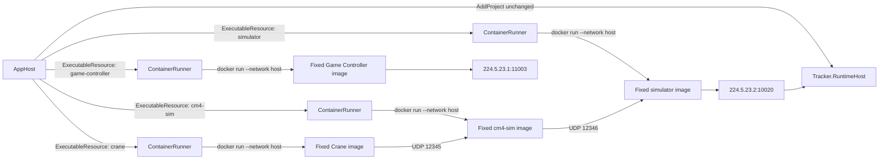

# ASPIRE-005 host-network wrapper resource design review

## Status

This is a design proposal for parent review. It does not change the accepted resource implementation or claim runtime acceptance. The selected direction is one Aspire executable resource per Docker service, backed by a dedicated host process that owns one host-networked Docker container. `duck` remains an Aspire project resource.

## Context and version evidence

The hosted failure is tied to the exact AppHost and DCP used by the run:

- AppHost SDK: `Aspire.AppHost.Sdk/13.5.4` in `Testing/Duck.Testing.AppHost/Duck.Testing.AppHost.csproj`.
- Aspire package family and DCP binary path: `aspire.hosting.orchestration.linux-x64/13.5.4/tools/dcp`, captured in process tree diagnostics for run [37183858366](https://github.com/ibis-ssl/Duck/actions/runs/37183858366).
- DCP runtime version: `0.25.13`, confirmed in the second-opinion runtime inspection; the corresponding source tag is [microsoft/dcp v0.25.13](https://github.com/microsoft/dcp/tree/v0.25.13).
- Aspire's matching source is [microsoft/aspire v13.5.4](https://github.com/microsoft/aspire/tree/v13.5.4). Its [ContainerCreator](https://github.com/microsoft/aspire/blob/v13.5.4/src/Aspire.Hosting/Dcp/ContainerCreator.cs#L175-L198) attaches containers to the generated user-defined network and says custom container networks are unsupported. Runtime arguments are added independently in [ContainerCreator](https://github.com/microsoft/aspire/blob/v13.5.4/src/Aspire.Hosting/Dcp/ContainerCreator.cs#L900-L920). This explains the observed Docker create rejection when `--network host` is appended.
- DCP v0.25.13's [process executable runner](https://github.com/microsoft/dcp/blob/v0.25.13/internal/exerunners/process_executable_runner.go#L577-L615) stops a Unix executable process directly and allows 15 seconds for it to stop. It does not promise to terminate arbitrary grandchildren. The wrapper must therefore own and finish its Docker CLI children and container cleanup as part of its own graceful stop.

The run's DCP logs in artifact `11296590601` recorded exit code 125 and `cannot attach both user-defined and non-user-defined network-modes` for both `game-controller` and `simulator`. This happened before the acceptance harness began receiving or waiting for referee traffic.

## Proposed topology

Each wrapper is a separate Aspire `ExecutableResource`, named after its service (`simulator`, `game-controller`, `cm4-sim`, `crane`). A single wrapper program accepts a per-resource, non-secret configuration and starts only that resource's pinned image. Do not group the services into one Compose resource. Keep the existing `StackOwnershipLease` acquired before resource startup and keep Duck as `AddProject<Projects.Tracker_RuntimeHost>("duck")`, preserving the local .NET debugging path.

The AppHost passes the existing image, fixed tag, entrypoint, args, team/planner, and ports to the wrapper. It does not add a new image or change daemon/OS settings. Each Docker command uses `--network host`, no `-p`, `--restart=no`, a unique container name, and ownership labels. It must not use a shell command string. Build and launch the wrapper as a direct executable; do not put `dotnet run`, `bash -c`, or another unsupervised process layer between DCP and the wrapper.

## Ownership identity and Docker commands

At AppHost startup, create a random stack-run ID. Give each wrapper a distinct resource-run ID. Pass both to each wrapper as ordinary non-secret config. A container is owned only when its Docker ID, generated name, and all expected labels match:

- `com.ibis-ssl.duck.aspire.stack=<stack-run-id>`
- `com.ibis-ssl.duck.aspire.resource=<resource-name>`
- `com.ibis-ssl.duck.aspire.owner=<resource-run-id>`

The wrapper uses `docker run --detach --cidfile ... --name ... --label ... --network host ...`. Do not set `--rm`: retain the stopped container long enough to capture its exit status, inspect, and final logs, then remove that exact owned ID. If startup is interrupted before the ID is recorded, query only the exact owner/resource labels generated for this invocation; inspect the returned container and verify all labels and the generated name before stopping or removing it. Never use image filters, wildcard name removal, `docker system prune`, or a stack-wide label lacking the unique run ID for cleanup.

An image pull that finishes after cancellation may remain in Docker's image cache. Do not remove images. Container ownership and cleanup do not grant permission to modify Docker daemon settings or remove unrelated containers.

## Readiness contract

Starting the wrapper process or receiving a container ID is not readiness. Each wrapper has separate live and ready state:

- `/health/live` means the wrapper process is servicing health requests.
- `/health/ready` returns success only after the real container is Running and that service's preparation probe passes. Before that it returns not-ready; a failed or exited container never remains ready.
- AppHost attaches Aspire's `WithHttpHealthCheck("/health/ready", endpointName: "health")` to each executable and uses `WaitFor` for dependencies whose readiness matters. Allocate the wrapper's health endpoint in AppHost and pass its resolved listen URL to the wrapper; do not expose the health listener beyond the local host.

The service-specific probe table is the initial contract. Every profile has a finite startup deadline; timeout produces a nonzero wrapper exit with the failing predicate and collected inspect/log evidence.

| Service | Ready only after |
| --- | --- |
| `simulator` | Docker inspect confirms the owned container is Running, and the wrapper receives and decodes an SSL-Vision detection packet on `224.5.23.2:10020`. This is a preparation signal; the acceptance harness still verifies sustained Vision traffic and robot motion. |
| `game-controller` | Docker inspect confirms Running, and the wrapper decodes the initial `HALT` referee state from `224.5.23.1:11003`. This preserves the fixture's initial-state contract; the acceptance test independently observes HALT and the subsequent active transition. |
| `cm4-sim` | Docker inspect confirms Running, and the configured UDP listener on `12345` is bound by the process belonging to this exact container. A free/busy port test alone is insufficient. The active acceptance test remains responsible for proving Crane → `cm4-sim` → simulator effects. |
| `crane` | Docker inspect confirms Running, and a bounded probe inside the owned container confirms the expected ROS graph includes `crane_session_coordinator`. The pinned `crane` launch source includes this node. The acceptance test remains responsible for proving active commands and motion. |

The `cm4-sim` process-identity listener probe is Linux-specific because the initial hosted acceptance target is Linux. If an equivalent ownership-sensitive probe cannot be implemented on another supported OS, readiness must fail clearly there until a platform-specific probe is designed; do not silently reduce it to “container is running.” The active-motion acceptance stays the end-to-end proof for UDP 12345/12346 and resulting Vision movement.

The probe implementation must join the existing multicast groups with the selected IPv4 interface and `SO_REUSEADDR`; it must not consume the sole copy of a packet. The runner readiness counters are separate from test-harness consumer counts. A later timeout report must distinguish “not reached,” “datagram observed,” and “valid service state observed.”

## Dependency graph

Use health-based `WaitFor` only where the dependency needs its preparation predicate; preserve project startup semantics for Duck:

1. `simulator` and `game-controller` start independently and can become ready in parallel.
2. `duck` and `cm4-sim` wait for `simulator` readiness. Their own starts may proceed in parallel after that.
3. `crane` waits for `cm4-sim` readiness, Game Controller readiness, and Duck's existing project-start signal. The motion acceptance verifies the eventual end-to-end path.
4. Comparison trackers, when present, wait for ready `simulator` and `game-controller`; each retains its own readiness contract.

When the selected planner excludes `cm4-sim`, Crane has no `cm4-sim` dependency. `WithReference` continues to carry endpoint/configuration references only; it is not used as a readiness guarantee.

## Wrapper lifecycle and failure behavior

The wrapper is a long-running host process and is responsible for exactly one container.

1. **Start:** Validate its immutable per-resource config, launch `docker run -d` with the unique name/labels/cidfile, then inspect by ID and verify ownership labels, expected image and host network mode. Start forwarding the container's stdout and stderr into the wrapper's corresponding output streams.
2. **Become ready:** Run the service-specific probe. Only then does `/health/ready` report success and allow downstream `WaitFor` resources to start.
3. **Container exits:** Mark readiness false, collect `docker inspect`, exit code, and final logs, remove the owned container, and exit nonzero for an unexpected service exit. Do not translate an early service failure into healthy process startup.
4. **Startup failure or readiness timeout:** Record the failed command stage and bounded diagnostics, then stop/remove only a container matching this invocation's exact ownership identity. Exit nonzero so Aspire marks the resource failed and dependent resources do not start.
5. **Cancellation / AppHost graceful stop:** Handle SIGINT/SIGTERM through .NET host lifetime cancellation. Mark readiness false; cancel and await the wrapper's Docker CLI/log subprocesses; stop the owned running container with a bounded grace period; collect final state/logs; remove its exact ID; then exit. AppHost-level shutdown must not return before each wrapper has finished this cleanup.

All child process creation goes through one supervisor. It uses direct argument arrays, redirects and drains both output streams, applies command timeouts, and on cancellation kills and awaits that child before returning. The long-running log follower is explicitly cancelled and awaited. No child process is detached or left for the DCP controller to discover. The wrapper's total graceful shutdown budget must be below DCP 0.25.13's 15-second process-stop timeout; reserve time for `docker stop` and `docker rm`, and return a nonzero cleanup result if the daemon does not respond within the bound. A hard kill, host power loss, or daemon outage cannot promise automatic cleanup; exact labels keep any residual attributable without broad removal.

For a startup race where `docker run -d` is cancelled after the daemon accepted the request but before the client returns the ID, the wrapper performs the exact-owner label query described above after it has cancelled/awaited the CLI child. This is the only discovery fallback and remains restricted to this resource-run ID.

## Observability and debugging tradeoffs

The Aspire dashboard will show one live/ready/failed host executable per service, plus its forwarded container logs. DCP will no longer own or inspect these service containers. The wrapper must log service name, stack/resource-run IDs, fixed image reference, container ID/name, state transitions, readiness predicate, stop/remove result, and exit code. It must not log credentials or dump full environment variables. The existing workflow's container snapshot and scoped cleanup remain a CI fallback if AppHost is forcibly terminated; they do not turn the wrapper resource into a DCP ContainerResource.

This preserves per-service dashboard grouping, dependency edges, host UDP behavior, fixed images, and Duck's .NET debug resource, but loses first-class Docker-container details from DCP. Container state/inspect must be available through wrapper logs and acceptance artifacts. Parent should confirm this observability tradeoff before implementation.

## Alternatives considered

| Option | Fit to current requirements | Reason not selected for this proposal |
| --- | --- | --- |
| Aspire DCP ContainerResource with `--network host` runtime args | Fails before resource startup on the observed 13.5.4/0.25.13 runtime. | DCP attaches its generated user-defined network and appends the runtime args; Docker rejects both network modes. |
| One Compose resource | Supports host networking and Docker's native service cleanup. | Collapses service status/dependencies/log grouping into one AppHost resource and fails the request to preserve service-level resources. |
| Per-service wrapper executable resources | Supports one host-networked Docker container per AppHost resource. | Selected for design. Requires explicit health/readiness, label ownership, process supervision, and cleanup contracts. |
| Bridge network plus multicast relay / unicast conversion | May retain DCP-managed containers. | Changes the current network path and adds relay behavior whose multicast, referee, tracker, and control-port semantics are not yet verified. Keep as a separate future design unless the wrapper lifecycle proves unacceptable. |

## Validation required before acceptance

The design is not runtime-validated. Implementation must add focused model and wrapper tests before using hosted full-stack acceptance again:

- AppHost model tests prove each service is a separate executable wrapper with the existing fixed image/args, no DCP ContainerResource, host network, no port publication, expected readiness profile, and intended `WaitFor` graph; Duck remains `AddProject`.
- Wrapper process tests use a fake Docker CLI executable to cover: create/start success, failed pull/create, timeout before ID output, ID-label mismatch, unexpected container exit, cancellation during create/start, cancellation during readiness, cancellation while logs are being forwarded, AppHost SIGTERM, graceful shutdown deadline, and foreign container untouched.
- Health tests prove process-start/container-ID alone remains unready and only each service's configured predicate becomes ready.
- The next hosted run, after design approval and implementation/review, confirms all four real fixed images start with `.HostConfig.NetworkMode=host`, wrapper cleanup completes within DCP's stop window, and artifacts contain per-service inspect/log/readiness evidence. Then run the full acceptance to prove packets, referee transition, tracker output, active motion, and ownership lock.

No hosted full-stack run was repeated for this design task.

## Ordinary design review

Review mode: ordinary design self-review of this proposal against the parent request and current design/source; no independent reviewer was dispatched in this execution environment.

- **Finding D1 — readiness evidence remains an implementation gate (required):** The cm4-sim profile depends on observing UDP 12345 bound by the process owned by the exact container. A port merely being occupied is not enough. Implementation must prove the container PID/socket mapping on the hosted Linux runner with a focused probe test before implementing that readiness profile; if process identity is not observable without unsafe host changes, return to the parent with that blocker instead of weakening the check.
- **Finding D2 — the 15-second DCP stop ceiling constrains cleanup (required):** DCP's executable runner waits at most 15 seconds on Unix. Every cancellation path must cancel/await the active Docker CLI child and finish `docker stop`/`rm` inside a shorter explicit deadline. The wrapper test must measure this contract; workflow post-job cleanup is only a fallback.
- **Finding D3 — executable resources do not provide DCP container details (accepted tradeoff, parent confirmation requested):** The dashboard reflects the wrapper process and health state, while inspect/log data are surfaced by the wrapper. If the parent requires the Docker container itself in DCP's container diagnostics view, this design does not satisfy that requirement without an additional mechanism.
- **Finding D4 — graceful shutdown is distinct from host crash (documented residual):** SIGINT/SIGTERM and cancellation are handled by the wrapper. SIGKILL, machine loss, or an unavailable Docker daemon can leave an exact-label-owned container; the design does not claim cleanup for those events and prohibits broad automatic cleanup.

Review verdict: **conditional pass for parent design confirmation; implementation must close D1 and D2 with focused evidence.** No code, workflow, or daemon settings were changed and no image was pulled.

## Parent confirmation requested

Please confirm:

1. Service-level dashboard state may represent a healthy wrapper rather than a first-class DCP container, with the wrapper forwarding logs and recording container inspect details.
2. Each wrapper may use service-specific readiness and health-based `WaitFor`, including the initial referee HALT and Crane ROS graph probes.
3. SIGINT/SIGTERM cleanup under the DCP 15-second ceiling is the promised shutdown contract; SIGKILL/host loss/daemon failure remains an explicitly documented residual.
4. Proceed to focused wrapper/model tests and implementation only after the exact cm4-sim listener-ownership readiness probe is shown feasible on the supported Linux runner.
